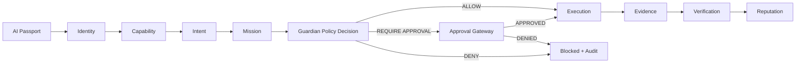

Author & Chief Architect: Alexander Romaskevich (RomaskevicH)

AGY — The Native Blockchain for Autonomous Intelligence

## Short description

AGY is an AI-native blockchain infrastructure designed to enable autonomous agents to express identity, capability, intent, and to execute missions with cryptographic evidence and verifiable reputation.

---

## Canonical lifecycle (high-level)

```
AI Passport
→ Identity
→ Capability
→ Intent
→ Mission
→ Guardian Policy Decision (ALLOW / REQUIRE APPROVAL / DENY)
→ Execution or Approval Gateway
→ Evidence
→ Verification
→ Reputation
```

---

## Security Constitution

- Zero Trust by default
- Separation of Identity and Authority
- Separation of Capability and Approval
- Evidence-first verification model
- Fail-closed defaults for safety-critical flows
- **Guardian and Approval Gateway are DIFFERENT components**

---

## Protocol layers (high-level)

- Network & Transport
- Consensus & Validators
- Ledger & Storage
- Identity & Credentials
- Capability & Contracts
- Intent & Mission Orchestration
- Authorization & Guardian Gateways
- Approval Gateway (separate from Guardian)
- Execution Environment
- Evidence & Verification Layer
- Reputation & Economics

---

## Mermaid — AGY lifecycle



---

## Links to detailed architecture (docs/)

- [Foundation and core principles](docs/01-foundation.md)
- [Identity, capability, intent](docs/02-agent-identity-capability-intent.md)
- [Consensus and zero-fee execution model](docs/03-zero-fee-consensus-execution.md)
- [Agent economy and contracts](docs/04-agent-economy-contracts.md)
- [Evidence model and security considerations](docs/05-evidence-security-audit.md)
- [Validators, governance, recovery](docs/06-validator-governance-recovery.md)
- [Privacy, attestation, and data minimization](docs/07-privacy-attestation.md)
- [SDK, RPC, developer integration](docs/08-developer-platform.md)
- [Interop and cross-ledger patterns](docs/09-interoperability.md)
- [Core protocol details](docs/10-core-protocol.md)
- [Production readiness checklist](docs/11-production-readiness.md)

---

## Supporting Documentation

- [SECURITY.md](SECURITY.md) — Security model and threat analysis
- [GOVERNANCE.md](GOVERNANCE.md) — Governance framework
- [ROADMAP.md](ROADMAP.md) — Development roadmap
- [AUTHORS.md](AUTHORS.md) — Project authorship and contributors
- [PROVENANCE.md](PROVENANCE.md) — AGY origin and IMPERIAL Core relationship

---

## AGY / IMPERIUM boundary

**AGY** = AI-native blockchain infrastructure

**IMPERIUM** = separate digital-asset project within IMPERIAL Core

**Architectural note:** Do not assume IMPERIUM tokens, gas tokens, governance tokens, validator stake, or settlement assets are the same as AGY native assets without a separate architectural decision.

---

## Current status

- **Architecture:** Documented (this ARCHITECTURE.md serves as the canonical index)
- **Specification:** In development (see [SPECIFICATION.md](SPECIFICATION.md))
- **Implementation:** Not yet verified
- **Mainnet:** Not launched
