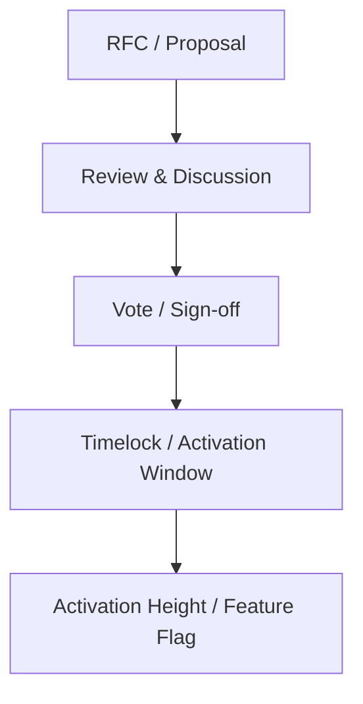

Author & Chief Architect: Alexander Romaskevich (RomaskevicH)

Governance overview
- Validator governance: Rules and processes that govern validator onboarding, slashing, and removal.
- Protocol governance: Upgrade proposals, activation heights, and timelocks for protocol-level changes.
- Security governance: Emergency response, incident triage, and mitigation pathways.
- Upgrade proposals: Formal RFC-like proposal process for protocol changes. Proposals must include specification changes, migration plan, and activation parameters.
- Voting: Defined voting mechanisms for validators and stakeholders; thresholds and quorums specified in the specification.
- Timelocks: Changes must include a timelock window to allow for community review and client upgrades.
- Activation height: Protocol changes use activation heights and feature flags to coordinate rollouts.
- Emergency governance: Defined escape hatches and short-circuit procedures for critical vulnerabilities; emergency actions require multi-party approvals and are time-limited.
- Separation of powers: Clear boundaries between proposers, implementers, validators, and the architectural authority.

Constraints
- Do not grant automatic governance authority to autonomous agents or AI intelligence without explicit review and safeguards.

Mermaid — governance flow (simplified)

