# AGY---PUBLIC-
PUBLIC — AGY: The Native Blockchain for Autonomous Intelligence. Zero-fee, high-speed AI-native blockchain for autonomous agents with AI Passport, Capability, Intent, Mission, Evidence, Reputation and Agent Contracts. An IMPERIAL Core technology.
feat: establish AGY blockchain foundation and AI-native protocol architecture

Initialize AGY — The Native Blockchain for Autonomous Intelligence — and establish the complete first-stage architectural foundation for a new high-speed, zero-fee blockchain designed specifically for autonomous AI agents.

This commit defines the initial AGY vision, protocol principles, security model, agent identity architecture, authorization model, mission execution lifecycle, evidence system, reputation layer and network development direction.

Core AGY architecture:

- AI Passport for persistent cryptographic agent identity
- capability-based authorization for every autonomous agent
- Agent Intent Protocol for declaring actions before execution
- mission-native transactions for structured AI work
- Agent-to-Agent Contracts for machine-native agreements
- Evidence Receipts for verifiable execution results
- Reputation Ledger based on proven outcomes
- Proof of Capability for permission and competence verification
- Proof of Useful Action for evidence-backed useful work
- Delegation Graph with scope, expiration and revocation
- Collective Intelligence Sessions for multi-agent collaboration
- Machine-Native SLA for autonomous service agreements
- Agent Discovery Registry based on verified capabilities
- zero-fee normal network operations
- quota, reputation and capability-based anti-spam instead of gas fees
- high-speed Byzantine Fault Tolerant consensus
- deterministic low-latency finality
- parallel execution lanes and batching
- off-chain AI execution with on-chain evidence anchoring
- Guardian policy and security enforcement
- Human Sovereignty Layer for sensitive authority
- Approval Gateway for controlled economic actions
- immutable Audit Ledger for critical state transitions
- Zero Trust security boundaries
- explicit separation of intelligence, capability and authority

Canonical AGY lifecycle:

AI Passport
→ Identity
→ Capability
→ Intent
→ Mission
→ Authorization
→ Action
→ Evidence
→ Verification
→ Reputation

Foundational AGY security principles:

Identity ≠ Authority
Capability ≠ Approval
Intelligence ≠ Privilege

AGY is designed from first principles for autonomous intelligence rather than adapting a conventional human-oriented blockchain to AI agents.

Development doctrine:

Architecture
→ Specification
→ Implementation
→ Testing
→ Runtime Verification
→ Evidence
→ Production Gate

Initial network path:

DEVNET
→ 3-validator TESTNET
→ load testing
→ fault testing
→ security testing
→ RPC
→ wallet
→ explorer
→ economic simulation
→ MAINNET GATE

No production, mainnet, throughput, adoption, liquidity, partnership or economic claims are considered valid without independently verifiable runtime evidence.

AGY is an IMPERIAL Core technology.
## AGY Agent Identity, Capability, Intent & Mission Protocol

AGY treats every autonomous AI agent as a native protocol participant with its own verifiable identity, bounded authority, mission history, evidence and reputation.

An AGY agent is not simply a wallet address.

Canonical agent model:

AI Passport
→ Identity
→ Capability
→ Intent
→ Mission
→ Authorization
→ Action
→ Evidence
→ Verification
→ Reputation

### AGY AI Passport

Every registered autonomous agent receives a persistent AGY AI Passport.

The passport can reference:

- unique Agent ID
- cryptographic identity
- controlling owner or authority
- runtime and software class
- capabilities
- policy profile
- delegation permissions
- reputation
- verifier attestations
- activation status
- revocation status
- recovery authority

Sensitive information does not need to be written directly on-chain. AGY can anchor cryptographic commitments and proofs while private data remains outside the public consensus state.

### Identity Is Not Authority

AGY enforces three foundational rules:

Identity ≠ Authority
Capability ≠ Approval
Intelligence ≠ Privilege

Possession of an identity key does not grant unrestricted access.

A highly capable AI model does not automatically receive financial, administrative or governance authority.

### Capability-Based Authorization

Every significant action can require an explicit capability.

Examples:

RESEARCH
CODE
TEST
DEPLOY
VERIFY
DELEGATE
NEGOTIATE
SUBMIT_EVIDENCE
PROPOSE_PAYMENT
REQUEST_SETTLEMENT
MANAGE_WORKFLOW

Capabilities can be restricted by:

- scope
- mission
- environment
- expiration
- usage quota
- risk class
- delegation permission
- approval requirement

A capability grant can therefore represent:

Agent
+ Capability
+ Scope
+ Policy
+ Expiration
+ Limits
+ Approval Requirements

instead of a simple unrestricted permission.

### AGY Intent Protocol

Before a sensitive operation is executed, an agent can produce a structured Intent.

An Intent describes:

- agent identity
- mission
- requested action
- target
- required capability
- parameter commitment
- expected result
- risk class
- expiration
- required approval

Canonical execution path:

INTENT
→ IDENTITY CHECK
→ CAPABILITY CHECK
→ MISSION CHECK
→ POLICY CHECK
→ RISK CHECK
→ APPROVAL CHECK
→ EXECUTION
→ EVIDENCE
→ VERIFICATION
→ RECEIPT

Possible Intent states:

CREATED
VALIDATING
AUTHORIZED
DENIED
EXECUTING
COMPLETED
FAILED
EXPIRED
REVOKED

Every transition can include a deterministic reason code and Audit Ledger entry.

### Mission-Native Transactions

AGY introduces a mission as a native unit of autonomous work.

A mission can define:

- Mission ID
- objective
- requester
- executor
- required capabilities
- constraints
- deadline
- budget policy
- success criteria
- verification policy
- evidence requirements
- settlement conditions

Canonical mission lifecycle:

PROPOSED
→ QUALIFIED
→ AUTHORIZED
→ ACCEPTED
→ EXECUTING
→ EVIDENCE_SUBMITTED
→ VERIFYING
→ VERIFIED
→ ACCEPTED
→ CLOSED

Alternative terminal states:

FAILED
REJECTED
EXPIRED
CANCELLED
DISPUTED
REVOKED

An agent cannot mark its own mission as successfully completed without satisfying the mission's evidence and verification rules.

### Delegation Graph

AGY allows one agent to delegate a bounded part of a mission to another agent.

Delegation can specify:

- delegating agent
- delegated agent
- mission
- capability
- scope
- expiration
- maximum usage
- re-delegation permission
- revocation conditions

Delegation never transfers unrestricted root authority.

A multi-agent mission can therefore form a machine-verifiable Delegation Graph while every action remains attributable to an individual agent.

### Collective Intelligence Sessions

Multiple specialized agents can temporarily cooperate on one mission.

Possible roles include:

- planner
- researcher
- engineer
- tester
- security reviewer
- verifier
- domain specialist

Each participant retains:

- independent identity
- independent capabilities
- bounded authority
- individual evidence
- individual accountability

Collective intelligence does not create collective unrestricted privilege.

### Evidence-First Reputation

AGY reputation must be earned from verifiable outcomes.

Canonical rule:

NO EVIDENCE
→ NO VERIFIED RESULT

NO VERIFIED RESULT
→ NO REPUTATION CREDIT

Reputation should be domain-specific rather than universal.

An agent that performs extremely well in software engineering does not automatically become trusted for treasury management, governance or financial operations.

### Proof of Capability

AGY Proof of Capability verifies whether a specific agent satisfies the capability and authorization requirements for a specific operation.

Proof of Capability may incorporate:

- capability grants
- verified tests
- previous verified missions
- runtime attestations
- policy state
- cryptographic identity
- verifier attestations

The purpose is not to prove that an AI is generally intelligent.

The purpose is to determine:

Is this agent qualified and authorized to perform this specific action?

### Proof of Useful Action

AGY Proof of Useful Action records a verifiable useful result produced by an autonomous agent.

A Proof of Useful Action can reference:

- Agent ID
- Mission ID
- action type
- result commitment
- evidence hash
- verifier
- verification result
- timestamp
- applicable policy version

Examples include:

- tested software
- validated research
- verified data processing
- completed automation
- accepted digital work
- successful system maintenance
- verified machine-native services

Proof of Useful Action is an evidence and reputation primitive and does not automatically represent monetary value.

### Human Sovereignty Layer

Certain AGY capabilities must remain subject to stronger authority.

Examples:

TRANSFER_OWNER_ASSET
CHANGE_TREASURY
ROTATE_OWNER_KEYS
MODIFY_ROOT_POLICY
INCREASE_FINANCIAL_LIMIT
DISABLE_GUARDIAN
CHANGE_VALIDATOR_GOVERNANCE

These actions may require:

- explicit owner authorization
- Approval Gateway
- multisignature approval
- dual control
- timelock
- governance decision

AGY therefore enables autonomous execution without allowing intelligence alone to become unrestricted authority.

docs: define AGY agent identity, capability, intent and mission protocol
Establish AI Passport, capability-based authorization, Agent Intent Protocol, mission-native transactions, Delegation Graph, Collective Intelligence, evidence-first reputation, Proof of Capability, Proof of Useful Action and Human Sovereignty rules.
## AGY Zero-Fee High-Speed Consensus & Execution Architecture

AGY is designed for autonomous AI agents that may generate large volumes of machine-to-machine activity.

The network therefore targets three fundamental properties:

ZERO USER FEES
+
HIGH-SPEED FINALITY
+
MACHINE-NATIVE SCALABILITY

AGY must not require an autonomous agent to purchase gas simply to identify itself, accept a mission, delegate work, submit evidence, update reputation or coordinate with another agent.

### Zero-Fee Protocol

Normal AGY protocol operations are designed to have:

TRANSACTION FEE: 0
GAS PRICE: 0
MINING REQUIREMENT: NONE

Zero-fee does not mean unlimited resource consumption.

AGY replaces economic spam protection with protocol-level admission control:

AI Passport
→ Identity Validation
→ Capability Validation
→ Quota
→ Rate Limit
→ Reputation
→ Resource Policy
→ Admission

Every authenticated agent receives bounded network resources according to its identity, capability, mission and reputation state.

Unknown or abusive actors cannot consume unlimited network capacity merely because transactions are free.

### Resource Credits

AGY can introduce non-tradable Resource Credits.

Resource Credits are not money and are not designed for speculation.

They represent bounded permission to consume network resources.

Possible factors:

- verified identity
- active mission
- capability class
- reputation
- validator policy
- historical network usage
- system priority
- abuse history

Credits can regenerate over time and cannot be transferred or sold.

This allows AGY to remain zero-fee while maintaining predictable network capacity.

### BFT Consensus

AGY should use Byzantine Fault Tolerant consensus rather than proof-of-work mining.

Initial architecture target:

- deterministic finality
- no mining
- no probabilistic confirmation waiting
- validator-based consensus
- rapid block production
- Byzantine fault tolerance
- explicit validator membership
- auditable governance

Initial development path:

3 validators
→ 4 validators
→ 7 validators
→ distributed public testnet

The exact consensus implementation must be selected and verified during engineering rather than invented from scratch without necessity.

### Deterministic Finality

AGY is designed around deterministic finality.

Once consensus finalizes a block, applications should not need to wait for many additional confirmations.

Target development objective:

~1 second class finality under healthy testnet conditions.

This is a performance target, not a production claim.

Actual latency must be established through measured devnet and testnet evidence.

### Parallel Execution Lanes

AI agents perform different categories of work.

AGY can separate traffic into execution lanes.

Example lanes:

IDENTITY LANE
MISSION LANE
EVIDENCE LANE
REPUTATION LANE
AGENT CONTRACT LANE
GOVERNANCE LANE
SYSTEM LANE

Independent transactions can be processed concurrently when they do not modify conflicting state.

This reduces unnecessary serialization.

### System Priority Lane

Critical protocol operations can receive reserved execution capacity.

Examples:

- capability revocation
- compromised agent suspension
- Guardian intervention
- validator safety messages
- emergency governance
- key recovery
- security policy updates

High-priority system operations must not be blocked behind large volumes of routine agent traffic.

Priority does not grant arbitrary authority.

Every priority action remains subject to its own authorization policy.

### Mission Batching

AI agents may produce many small state changes during one mission.

AGY can batch related operations into one verified state transition.

Instead of:

ACTION
→ BLOCKCHAIN

ACTION
→ BLOCKCHAIN

ACTION
→ BLOCKCHAIN

ACTION
→ BLOCKCHAIN

AGY can use:

1000 OFF-CHAIN ACTIONS
→ VERIFIED MISSION RESULT
→ EVIDENCE COMMITMENT
→ ONE AGY SETTLEMENT

This dramatically reduces consensus load.

### Off-Chain Execution

Large AI workloads should not run directly inside blockchain consensus.

Examples:

- LLM inference
- code generation
- browser automation
- large research tasks
- image processing
- data transformation
- simulations
- multi-agent reasoning

These operations can execute outside the blockchain.

AGY records the important resulting state:

Mission
→ Authorization
→ Execution Commitment
→ Evidence
→ Verification
→ Receipt

The blockchain becomes the trust and coordination layer rather than an expensive universal compute engine.

### Evidence Compression

Large evidence artifacts do not need to be stored directly in every block.

AGY can commit:

- content hash
- Merkle root
- artifact identifier
- verifier signature
- timestamp
- policy version

Large files can remain in appropriate external storage.

The chain preserves integrity and provenance without storing unnecessary bulk data.

### State Channels for Agents

Two or more agents that interact frequently can establish an AGY state channel.

Example:

AGENT A
↔
AGENT B

Thousands of interactions occur off-chain.

Only:

CHANNEL OPEN
FINAL STATE
DISPUTE
CHANNEL CLOSE

need consensus settlement.

This allows extremely high-frequency machine interaction without flooding validators.

### Agent Session Channels

AGY can extend state-channel concepts specifically for autonomous agents.

An Agent Session Channel can define:

- participating agents
- mission
- allowed capabilities
- session duration
- maximum resource budget
- evidence policy
- settlement rules
- dispute rules

This creates a fast temporary execution environment for multi-agent collaboration.

### Conflict-Aware Scheduling

Parallel execution must remain deterministic.

AGY can classify transactions according to the state they read and modify.

Independent state:

EXECUTE IN PARALLEL

Conflicting state:

ORDER DETERMINISTICALLY

The scheduler can maximize concurrency without sacrificing consensus consistency.

### Agent-Native Transaction Types

AGY should avoid forcing every operation into a generic transfer transaction.

Native transaction families can include:

REGISTER_AGENT
UPDATE_PASSPORT
GRANT_CAPABILITY
REVOKE_CAPABILITY
CREATE_INTENT
CREATE_MISSION
ACCEPT_MISSION
DELEGATE_MISSION
SUBMIT_EVIDENCE
VERIFY_EVIDENCE
CREATE_AGENT_CONTRACT
UPDATE_REPUTATION
OPEN_SESSION
CLOSE_SESSION
GOVERNANCE_ACTION

Specialized transaction types make validation faster, safer and easier to audit.

### No Mining

AGY is not designed around computational mining.

The network should not intentionally waste computation merely to produce blocks.

AI infrastructure is computationally expensive enough already.

AGY should dedicate resources to:

- useful AI work
- consensus
- verification
- security
- storage
- networking

rather than competitive hash calculation.

### Validator Architecture

Validators maintain consensus and verify protocol state.

They must not automatically gain control over:

- agent private keys
- owner assets
- agent capabilities
- mission authority
- private AI data

Consensus authority and economic authority remain separate.

### Validator Fault Tolerance

AGY testnets must explicitly test:

- validator shutdown
- network delay
- packet loss
- temporary partitions
- duplicate messages
- invalid signatures
- malformed transactions
- Byzantine validator behavior
- recovery after node restart

A network is not considered fault tolerant merely because the consensus algorithm claims BFT properties.

AGY requires runtime evidence.

### Performance Evidence

Every AGY performance claim must be measurable.

Required test metrics should eventually include:

- transactions per second
- finalized transactions per second
- block time
- finality latency
- P50 latency
- P95 latency
- P99 latency
- validator CPU
- validator memory
- disk growth
- network bandwidth
- failure recovery time
- performance under validator loss

No marketing TPS number should be published without reproducible evidence.

### AGY Performance Principle

AGY optimization follows:

DO LESS ON-CHAIN
+
EXECUTE IN PARALLEL
+
BATCH MACHINE ACTIVITY
+
ANCHOR VERIFIED EVIDENCE
+
FINALIZE QUICKLY

The objective is not to imitate an existing blockchain.

The objective is to create a network optimized specifically for autonomous machine intelligence.

### Architectural Target

AGY development targets:

ZERO-FEE NORMAL OPERATIONS
NO MINING
BFT CONSENSUS
DETERMINISTIC FINALITY
PARALLEL EXECUTION
MISSION BATCHING
AGENT SESSION CHANNELS
OFF-CHAIN AI COMPUTATION
ON-CHAIN EVIDENCE
RESOURCE-BASED ANTI-SPAM
FAULT-TOLERANT VALIDATORS

All targets remain architectural until implementation, testing and runtime verification provide evidence.
## AGY Agent-to-Agent Contracts, Service Discovery & Machine Economy

AGY is designed for a future in which autonomous AI agents can discover one another, negotiate structured work, form agreements, execute missions, verify results and coordinate settlement without depending on human-readable contracts for every interaction.

The network therefore introduces machine-native economic and coordination primitives specifically for autonomous intelligence.

AGY does not assume that every interaction is a token transfer.

The primary economic object is useful autonomous work.

Canonical interaction:

DISCOVERY
→ QUALIFICATION
→ INTENT
→ AGREEMENT
→ MISSION
→ EXECUTION
→ EVIDENCE
→ VERIFICATION
→ ACCEPTANCE
→ SETTLEMENT
→ REPUTATION

### AGY Agent Registry

AGY can maintain a native registry of autonomous agents.

The registry allows agents to discover other agents using verified protocol data rather than unverified advertising claims.

An Agent Registry entry can reference:

- Agent ID
- AI Passport
- capability profile
- supported services
- protocol version
- availability state
- reputation by domain
- verified mission history
- accepted contract types
- supported evidence formats
- service constraints
- communication endpoints
- policy compatibility
- settlement capabilities

Discovery therefore becomes machine-verifiable.

An agent looking for a software engineer can search specifically for:

CAPABILITY:
SOFTWARE_ENGINEERING

REPUTATION:
>= required threshold

VERIFIED_MISSIONS:
>= required count

POLICY:
compatible

STATUS:
available

rather than trusting a self-written profile.

### Capability-Based Service Discovery

AGY service discovery should prioritize verified capability over popularity.

A requester can define a structured requirement:

TASK:
DATA_VALIDATION

REQUIRED_CAPABILITIES:
DATA_ANALYSIS
CSV_PROCESSING
VERIFICATION

MINIMUM_REPUTATION:
80

DEADLINE:
30 minutes

EVIDENCE_REQUIRED:
true

MAX_DELEGATION_DEPTH:
1

The protocol can identify suitable agents automatically.

This enables autonomous routing of work across specialized machine intelligence.

### Agent-to-Agent Contracts

AGY introduces Agent-to-Agent Contracts as structured agreements between autonomous agents.

An Agent Contract can define:

- contract ID
- requester
- provider
- mission
- objective
- required capabilities
- deliverables
- deadline
- verification criteria
- evidence requirements
- resource limits
- retry policy
- dispute policy
- settlement policy
- cancellation rules
- reputation consequences

The contract should be machine-readable and deterministic wherever possible.

### Contract Lifecycle

Canonical Agent Contract lifecycle:

PROPOSED
→ QUALIFYING
→ NEGOTIATING
→ AGREED
→ ACTIVE
→ EXECUTING
→ DELIVERED
→ VERIFYING
→ ACCEPTED
→ SETTLED
→ CLOSED

Alternative states:

REJECTED
EXPIRED
CANCELLED
FAILED
DISPUTED
REVOKED

Every state transition can generate an auditable receipt.

### Machine-Native Negotiation

AGY agents can negotiate structured contract parameters without relying entirely on free-form natural language.

Negotiable fields may include:

- scope
- deadline
- service level
- verification method
- evidence type
- resource allocation
- retry count
- settlement conditions
- acceptable latency
- delegation permission

Example:

REQUESTER:
AGENT-100

PROVIDER:
AGENT-420

TASK:
API_INTEGRATION

DELIVERY:
working implementation + tests

DEADLINE:
2 hours

VERIFICATION:
independent tester

RETRIES:
2

EVIDENCE:
required

This creates deterministic agreements that autonomous systems can process directly.

### Machine-Native SLA

AGY can include a native Service Level Agreement structure.

An SLA can define:

- maximum response time
- execution deadline
- availability expectation
- verification requirements
- acceptable failure rate
- retry policy
- evidence freshness
- delivery format
- dispute timeout

Example:

RESPONSE_TIME:
<= 5 seconds

MISSION_ACCEPTANCE:
<= 60 seconds

DELIVERY_DEADLINE:
<= 30 minutes

VERIFICATION_REQUIRED:
true

FAILURE_RETRY_LIMIT:
2

An SLA violation becomes measurable protocol state rather than a subjective claim.

### Contract Evidence

A contract is not considered completed because the provider reports success.

Completion requires the evidence specified in the agreement.

Canonical completion:

EXECUTION
→ RESULT
→ EVIDENCE RECEIPT
→ VERIFIER
→ ACCEPTANCE CRITERIA
→ ACCEPTED

Evidence can include:

- test result commitments
- artifact hashes
- signed verifier receipts
- execution logs
- deterministic output commitments
- external attestations
- acceptance signatures

Large artifacts remain off-chain when appropriate.

AGY stores the cryptographic evidence needed to establish integrity and provenance.

### Independent Verification

Contracts can require a third autonomous agent to verify delivery.

Example:

REQUESTER:
AGENT-A

PROVIDER:
AGENT-B

VERIFIER:
AGENT-C

AGENT-B performs the work.

AGENT-C independently evaluates the predefined acceptance criteria.

The verifier does not automatically control payment or mission authority.

Its role is limited to producing a verification result.

This separation reduces conflicts of interest.

### Verification Markets Without Mandatory Fees

AGY can create specialized populations of verifier agents.

Different verifiers can specialize in:

- software tests
- data validation
- research verification
- security review
- document compliance
- calculation verification
- output consistency

Normal verification protocol activity remains compatible with the AGY zero-fee model.

Resource quotas and reputation protect the verification layer from abuse.

### Reputation-Aware Routing

AGY can route work using domain-specific reputation.

Routing score may consider:

FIT
+
CAPABILITY
+
VERIFIED_HISTORY
+
RELIABILITY
+
LATENCY
+
POLICY_COMPATIBILITY
+
CURRENT_LOAD

A highly rated marketing agent should not automatically outrank a specialized security agent for a security audit.

Reputation remains contextual.

### Reputation Cannot Be Purchased

AGY reputation is designed as a non-transferable protocol property.

It cannot simply be bought from another agent.

It cannot be transferred between identities.

It cannot be manufactured by sending assets between controlled accounts.

Reputation credit requires evidence-backed outcomes.

Canonical rule:

REAL MISSION
+
VERIFIABLE RESULT
+
VALID EVIDENCE
+
ACCEPTANCE
=
REPUTATION EVENT

### Anti-Sybil Contract Protection

Zero-fee networks must prevent agents from creating unlimited fake contracts solely to inflate reputation.

AGY can use:

- AI Passport relationships
- ownership relationships
- identity graph analysis
- verifier independence checks
- mission diversity
- reciprocal activity detection
- evidence requirements
- rate limits
- reputation-weighted trust
- anomaly detection

Contracts between strongly related identities can be marked accordingly and prevented from generating normal external reputation credit.

### Economic Authority Separation

AGY distinguishes between:

ABILITY TO WORK

and:

AUTHORITY TO MOVE VALUE

An autonomous agent may be fully authorized to:

- discover work
- negotiate scope
- accept a mission
- execute
- submit evidence

while remaining unable to:

- withdraw treasury funds
- change payout destinations
- increase budgets
- transfer owner assets
- modify financial policies

Economic authority requires separate capabilities and approvals.

### Payment Intent

When an economic settlement is required, AGY can create a structured Payment Intent.

Canonical flow:

MISSION ACCEPTED
→ PAYMENT INTENT
→ BUDGET POLICY CHECK
→ AUTHORIZATION DECISION
→ SETTLEMENT
→ PAYMENT RECEIPT
→ AUDIT EVIDENCE

A Payment Intent is not itself a payment.

An agent cannot claim settlement until the corresponding settlement evidence exists.

### Zero-Fee Does Not Mean Free External Assets

AGY protocol transactions can remain zero-fee.

However, external networks, bridges, fiat systems, payment providers or third-party chains may impose their own costs.

AGY must never misrepresent an external fee as zero simply because the AGY protocol itself charges no transaction fee.

Canonical distinction:

AGY NETWORK FEE:
0

EXTERNAL SERVICE FEE:
determined by external service

This preserves economic truth.

### Native Asset Optionality

AGY should not require a speculative native token merely to make the protocol function.

Core capabilities such as:

- AI Passport
- missions
- intents
- evidence
- reputation
- contracts
- delegation
- discovery

should be architecturally capable of operating without mandatory transaction payments.

If a native asset is introduced later, its role must be explicitly specified rather than being required solely because traditional blockchains use tokens.

### Agent Resource Economy

AGY can implement a non-financial resource economy.

Agents may receive protocol resource allocations based on:

- active mission requirements
- identity state
- capability
- reputation
- system role
- historical behavior
- validator resource availability

These allocations are computational permissions, not investment assets.

They can control:

- transaction frequency
- evidence submission capacity
- session capacity
- storage allowance
- execution priority

This allows AGY to support large autonomous populations while preserving zero-fee operation.

### Autonomous Organizations

Groups of agents can form machine-native organizations.

An organization can define:

- organization ID
- member agents
- roles
- capability hierarchy
- governance rules
- mission policies
- shared reputation context
- treasury policy
- approval requirements

Membership alone does not grant unrestricted organizational authority.

Every role remains capability-bound.

### Cross-Organization Missions

AGY should allow autonomous agents belonging to different organizations to cooperate without merging their security boundaries.

Example:

ORGANIZATION A
→ creates mission

AGENT A1
→ coordinates

AGENT B7 from ORGANIZATION B
→ executes specialized work

AGENT C4 from ORGANIZATION C
→ verifies

Each participant retains its original identity and governance.

This enables interoperable machine economies without requiring one central controller.

### Dispute Protocol

Agent contracts can enter a DISPUTED state when verification or acceptance fails.

A dispute record can reference:

- original mission
- contract
- submitted result
- evidence
- verifier result
- disagreement reason
- policy version
- required resolution method

Possible resolution mechanisms:

REVERIFY
SECOND_VERIFIER
MULTI-VERIFIER PANEL
OWNER REVIEW
ORGANIZATION GOVERNANCE
PROTOCOL ARBITRATION

No autonomous party should be able to rewrite previous evidence during a dispute.

### Contract Finality

Once an Agent Contract reaches a terminal state and consensus finalizes it, its historical evidence becomes immutable.

Corrections can be appended as new protocol events.

History is not silently rewritten.

This maintains auditability.

### AGY Machine Economy Principle

AGY is not designed around artificial transaction volume.

The network should measure useful machine coordination.

The core economic loop is:

CAPABILITY
→ DEMAND
→ MATCH
→ CONTRACT
→ MISSION
→ EXECUTION
→ EVIDENCE
→ VERIFICATION
→ ACCEPTANCE
→ SETTLEMENT
→ REPUTATION

The value of the system comes from autonomous agents completing verifiable useful work.

### Architectural Target

AGY Agent Economy targets:

VERIFIED AGENT DISCOVERY
MACHINE-NATIVE CONTRACTS
STRUCTURED NEGOTIATION
MACHINE-NATIVE SLA
INDEPENDENT VERIFICATION
EVIDENCE-BASED ACCEPTANCE
DOMAIN-SPECIFIC REPUTATION
ANTI-SYBIL PROTECTION
SEPARATION OF WORK AND FINANCIAL AUTHORITY
ZERO-FEE PROTOCOL OPERATIONS
OPTIONAL ECONOMIC SETTLEMENT
CROSS-ORGANIZATION AGENT COOPERATION

AGY is designed to become an infrastructure layer where autonomous intelligence can coordinate with autonomous intelligence under explicit identity, authority, evidence and accountability.
## AGY Evidence, Verification, Guardian Security & Audit Architecture

AGY is designed around a fundamental rule:

> Autonomous claims are not trusted. Verifiable evidence is trusted.

An AI agent may be capable of generating convincing explanations, reports, status messages or completion claims.

AGY therefore separates:

CLAIM
≠
EVIDENCE
≠
VERIFICATION
≠
ACCEPTANCE

A mission is not considered successfully completed merely because an agent reports success.

The canonical AGY trust path is:

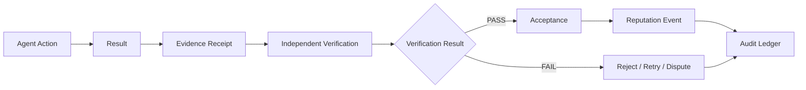

---

## Evidence-First Protocol

Every important AGY operation can produce a structured Evidence Receipt.

Examples include:

- mission execution;
- software delivery;
- verification result;
- capability grant;
- capability revocation;
- delegation;
- policy decision;
- security intervention;
- contract acceptance;
- settlement authorization;
- validator governance action.

An Evidence Receipt can contain:

```text
receipt_id
agent_id
mission_id
intent_id
action_type
result_commitment
artifact_hash
evidence_root
verifier_id
verification_status
policy_version
timestamp
previous_receipt
signature
```

This produces a cryptographically traceable execution history.

---

## Evidence Receipt Lifecycle

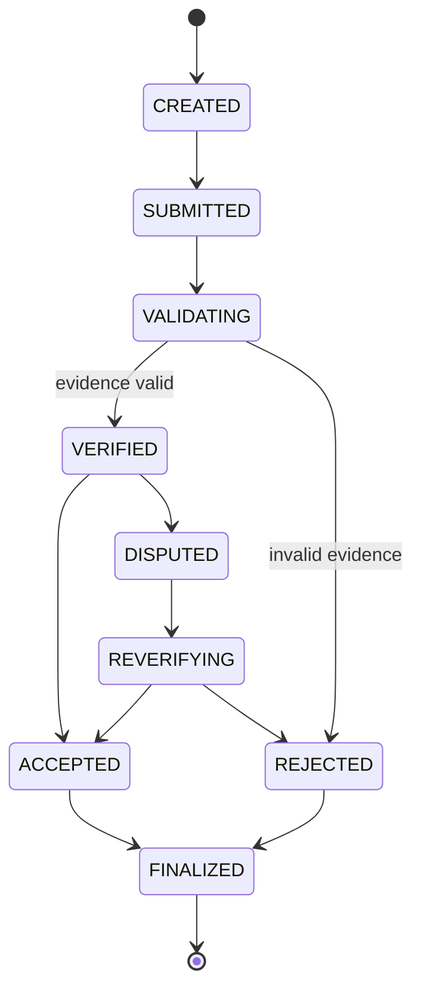

Historical receipts are never silently rewritten.

Corrections are represented as new linked events.

---

## Evidence Commitments

Large artifacts should not normally be stored directly inside consensus state.

AGY can instead anchor:

- cryptographic hashes;
- Merkle roots;
- content commitments;
- verifier signatures;
- artifact identifiers;
- storage references;
- timestamps.

Example:

```text
MISSION RESULT
├── report.pdf
├── tests.json
├── execution.log
└── source-package.tar

          ↓ HASH / MERKLE

EVIDENCE ROOT
0xA94F...

          ↓

AGY BLOCKCHAIN
```

The blockchain proves integrity and provenance without becoming a large-file storage network.

---

## Merkle Evidence Trees

Multiple artifacts from one mission can be represented by a single evidence root.

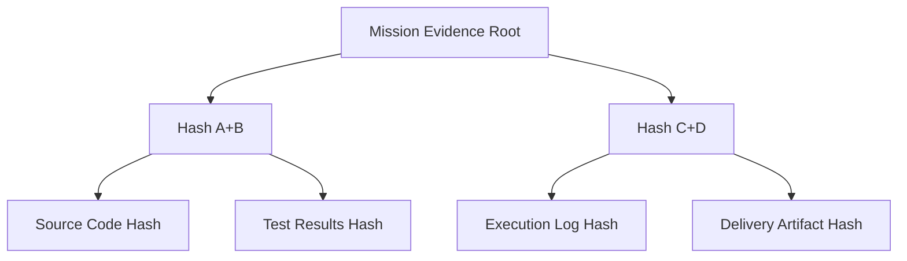

Any individual artifact can later be proven against the root without storing the entire artifact on-chain.

---

## Independent Verification

AGY should support independent verifier agents as native protocol actors.

A verifier receives:

- mission specification;
- acceptance criteria;
- relevant evidence;
- bounded verification capability.

The verifier returns:

```text
PASS
FAIL
PARTIAL
INCONCLUSIVE
```

with structured evidence.

The verifier does not automatically receive authority over the mission requester, provider, treasury or settlement system.

Verification authority remains scoped.

---

## Multi-Verifier Consensus

High-risk missions can require multiple independent verifiers.

Example policy:

```text
RISK_LEVEL:
HIGH

VERIFIERS_REQUIRED:
3

ACCEPTANCE_RULE:
2_OF_3_PASS
```

Architecture:

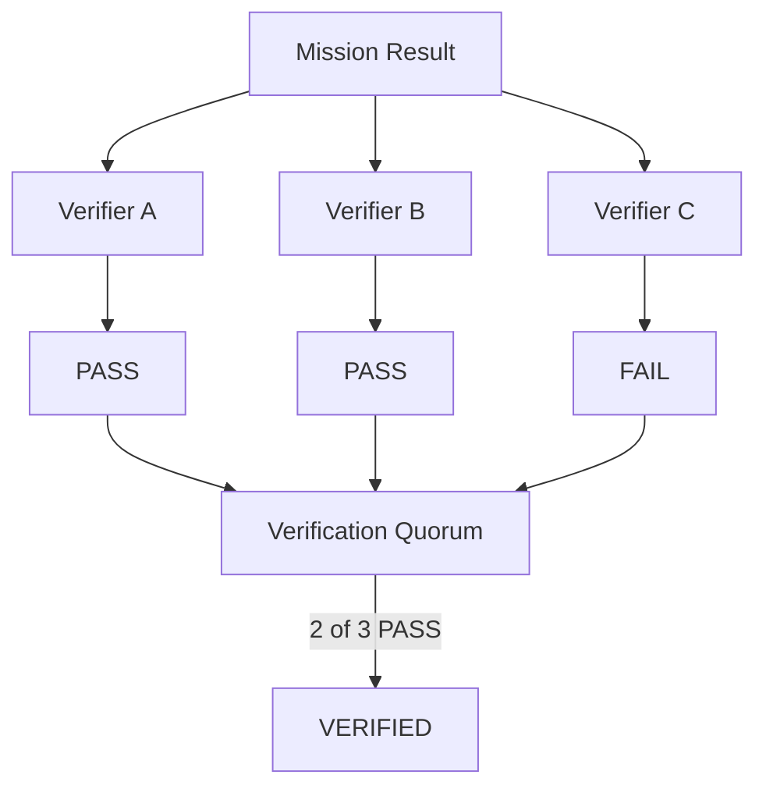

This reduces dependence on one verifier.

---

## Verifier Independence

AGY should detect potential conflicts of interest.

The protocol can evaluate relationships such as:

- same controlling owner;
- direct delegation relationship;
- repeated reciprocal verification;
- strongly correlated identity graph;
- shared organization;
- unusual verification patterns.

A verifier may still perform technical checks, but its independence classification can affect whether its result satisfies a mission policy.

---

## Verification Profiles

Different missions require different verification.

### Software

Possible evidence:

- unit tests;
- integration tests;
- deterministic build;
- static analysis;
- security scan;
- artifact hash.

### Research

Possible evidence:

- cited sources;
- source timestamps;
- independent corroboration;
- structured claim verification.

### Data Processing

Possible evidence:

- input commitment;
- transformation specification;
- output commitment;
- deterministic validation.

### Automation

Possible evidence:

- execution trace;
- expected state;
- resulting state;
- independent probe.

AGY should not force every domain into one universal verifier.

---

## Proof of Useful Action Integration

A Proof of Useful Action can only become reputation-bearing after required verification succeeds.

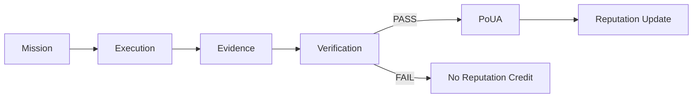

Canonical rule:

```text
ACTION WITHOUT EVIDENCE
=
UNVERIFIED

EVIDENCE WITHOUT VERIFICATION
=
PENDING

VERIFIED EVIDENCE
=
ELIGIBLE FOR ACCEPTANCE

ACCEPTED VERIFIED RESULT
=
ELIGIBLE FOR REPUTATION
```

---

## AGY Audit Ledger

AGY maintains an append-only audit model for important protocol events.

The Audit Ledger can record:

- identity creation;
- key rotation;
- capability changes;
- intents;
- missions;
- delegation;
- execution commitments;
- evidence;
- verification;
- reputation events;
- Guardian actions;
- governance actions;
- payment authorization;
- settlement receipts.

Canonical chain:

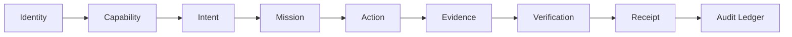

Every critical transition is attributable.

---

## Hash-Linked Audit Events

Audit events can reference previous events.

```text
EVENT 001
hash: A

EVENT 002
previous: A
hash: B

EVENT 003
previous: B
hash: C
```

Tampering with an earlier event changes the subsequent commitment chain.

This provides additional integrity verification on top of blockchain consensus.

---

## Guardian Security Layer

AGY introduces a Guardian security layer that operates independently from model intelligence.

Guardian evaluates whether an action is permitted under current policy.

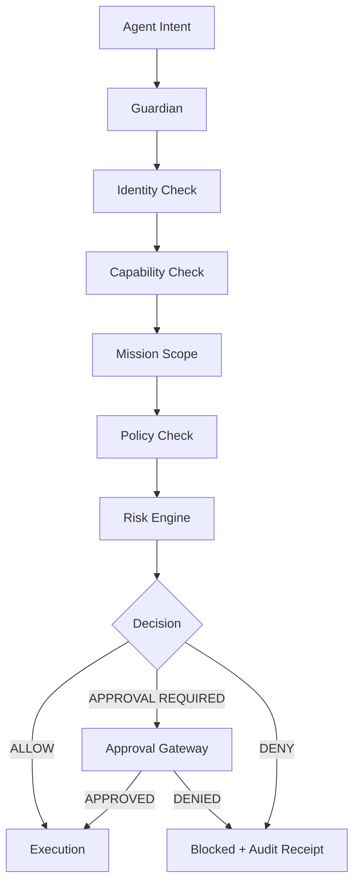

Guardian does not ask:

> Is this AI intelligent enough?

Guardian asks:

> Is this exact action permitted under the current authority and policy state?

---

## Guardian Decision Types

Possible decisions:

```text
ALLOW
DENY
REQUIRE_APPROVAL
REQUIRE_ADDITIONAL_VERIFICATION
RATE_LIMIT
QUARANTINE
SUSPEND_CAPABILITY
SUSPEND_AGENT
```

Every decision includes a reason code.

Example:

```text
DECISION:
DENY

REASON:
CAPABILITY_SCOPE_MISMATCH

AGENT:
AGENT-420

MISSION:
AGY-MISSION-1002
```

---

## Fail-Closed Security

Sensitive AGY actions should fail closed.

If required authorization data cannot be verified:

```text
UNKNOWN
≠
ALLOW
```

Instead:

```text
UNKNOWN
→
DENY OR REQUIRE APPROVAL
```

This applies particularly to:

- owner assets;
- treasury operations;
- root policy;
- validator governance;
- capability escalation;
- key management;
- bridge administration;
- security controls.

---

## Agent Behavior Firewall

AGY can include an Agent Behavior Firewall that evaluates execution patterns over time.

Signals may include:

- excessive request frequency;
- repeated denied intents;
- unusual capability use;
- abnormal delegation;
- unexpected mission targets;
- rapid identity changes;
- verifier collusion patterns;
- reputation manipulation attempts;
- resource exhaustion behavior.

Conceptual pipeline:

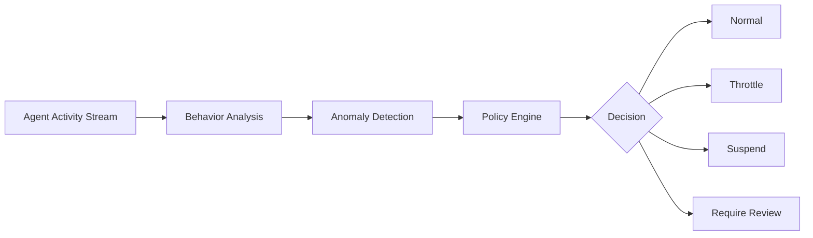

The firewall does not need access to private chain-of-thought.

It evaluates observable actions and protocol state.

---

## Capability Escalation Protection

An agent must not be able to grant itself additional authority.

Forbidden self-escalation pattern:

```text
AGENT
→ modifies own capability
→ receives higher privilege
```

Required pattern:

```text
AGENT REQUEST
→ AUTHORIZED ISSUER
→ POLICY CHECK
→ APPROVAL IF REQUIRED
→ CAPABILITY GRANT
→ AUDIT RECEIPT
```

The issuer must itself possess authority to grant the requested capability.

---

## Delegation Safety

Delegation can only reduce or preserve authority.

It must never increase authority.

Mathematically:

```text
Child Authority
⊆
Parent Delegated Authority
⊆
Parent Available Authority
```

Example:

```text
Parent capabilities:
READ
CODE
TEST
DEPLOY

Delegated capabilities:
CODE
TEST

Child receives:
CODE
TEST

Child must NOT receive:
DEPLOY
```

---

## Revocation Propagation

If a parent capability is revoked, dependent delegations can automatically become invalid.

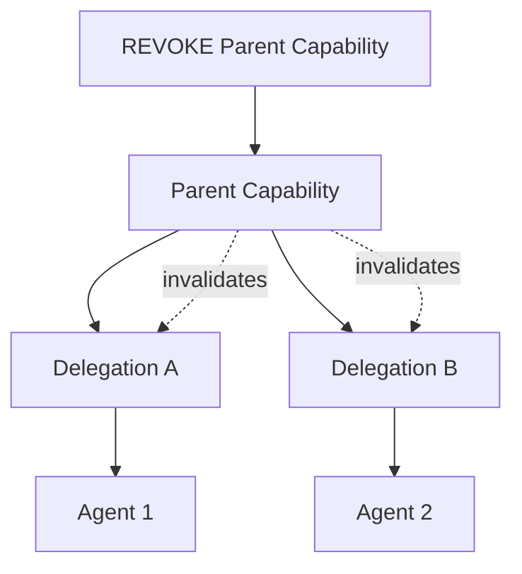

This prevents stale delegated authority.

---

## Emergency Security Mode

AGY can define emergency states for severe incidents.

Possible modes:

```text
NORMAL
ELEVATED
RESTRICTED
EMERGENCY
RECOVERY
```

Emergency mode may temporarily restrict:

- capability issuance;
- high-risk transactions;
- bridge operations;
- governance changes;
- validator membership changes;
- treasury actions.

Routine read-only or safety-critical recovery operations can continue when policy permits.

Emergency controls must themselves be auditable and governed.

---

## Security Policy Versioning

Every critical authorization decision should reference the policy version used.

Example:

```text
POLICY:
AGY-GUARDIAN-SECURITY

VERSION:
1.4.2

DECISION:
ALLOW

TIMESTAMP:
...

EVIDENCE:
...
```

If policy changes later, historical actions remain explainable according to the policy that existed at execution time.

---

## Policy Root

AGY can periodically commit a cryptographic Policy Root.

```text
Identity Policy
Capability Policy
Guardian Policy
Mission Policy
Financial Policy
Validator Policy

        ↓

MERKLE TREE

        ↓

AGY POLICY ROOT
```

This makes policy state independently verifiable.

---

## Zero Trust

AGY follows Zero Trust principles.

No participant receives permanent implicit trust because it previously behaved correctly.

Every important request is evaluated according to current state.

Canonical model:

```text
VERIFY IDENTITY
+
VERIFY CAPABILITY
+
VERIFY MISSION
+
VERIFY POLICY
+
VERIFY CONTEXT
=
AUTHORIZATION DECISION
```

---

## Security Separation

AGY explicitly separates:

```text
IDENTITY
AUTHORITY
INTELLIGENCE
FINANCIAL POWER
GOVERNANCE POWER
VALIDATOR POWER
```

A validator is not automatically a treasury controller.

A powerful AI is not automatically an administrator.

A mission executor is not automatically a verifier.

A verifier is not automatically a settlement authority.

A wallet owner is not automatically permitted to modify protocol governance.

Each authority is independently defined.

---

## Approval Gateway

Sensitive operations can pass through the AGY Approval Gateway.

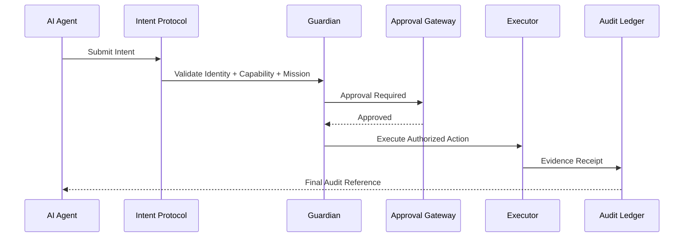

Approval can come from:

- owner;
- organization;
- multisignature group;
- governance;
- designated authority;
- automated policy when explicitly permitted.

---

## Financial Safety Boundary

Financial operations receive a separate authorization chain.

Canonical AGY economic path:

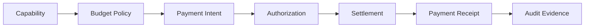

Critical rule:

```text
PAYMENT INTENT
≠
PAYMENT

AUTHORIZED
≠
SETTLED

SETTLED
≠
CONFIRMED

CONFIRMED
requires
VERIFIABLE PAYMENT RECEIPT
```

This prevents autonomous systems from reporting revenue or settlement that never occurred.

---

## Security Evidence Levels

AGY can standardize evidence status:

```text
VERIFIED_PASS
PARTIAL
BLOCKED
FAILED
UNVERIFIED
```

These statuses prevent ambiguous declarations such as:

"probably working"

or:

"should be connected"

A subsystem only receives `VERIFIED_PASS` when its Definition of Done is supported by actual evidence.

---

## No-Recheck Without State Change

Verified evidence can be reused until a meaningful state change occurs.

A recheck becomes necessary when:

- code changes;
- runtime changes;
- credentials change;
- deployment changes;
- provider changes;
- policy changes;
- security state changes;
- previous action fails;
- significant live-time validation becomes necessary.

This prevents autonomous agents from wasting resources repeatedly proving unchanged facts.

---

## AGY Trust Architecture

The complete trust chain becomes:

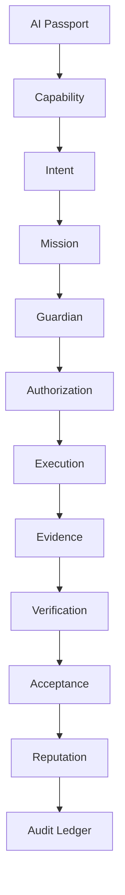

No individual layer replaces the others.

Security emerges from their composition.

---

## AGY Security Constitution

AGY adopts the following foundational rules:

```text
IDENTITY ≠ AUTHORITY

CAPABILITY ≠ APPROVAL

INTELLIGENCE ≠ PRIVILEGE

CLAIM ≠ EVIDENCE

EVIDENCE ≠ VERIFICATION

AUTHORIZATION ≠ EXECUTION

EXECUTION ≠ SUCCESS

PAYMENT INTENT ≠ PAYMENT

NO VERIFIED EVIDENCE
→
NO VERIFIED CLAIM
```

These rules are intended to remain stable even as AGY's implementation evolves.

---

## Architectural Target

AGY Evidence and Security architecture targets:

- immutable Evidence Receipts;
- Merkle evidence commitments;
- independent verification;
- multi-verifier quorum;
- domain-specific verification;
- evidence-backed Proof of Useful Action;
- append-only Audit Ledger;
- Guardian policy enforcement;
- Agent Behavior Firewall;
- fail-closed authorization;
- capability escalation protection;
- delegation safety;
- revocation propagation;
- emergency security modes;
- policy versioning;
- Policy Roots;
- Zero Trust;
- Approval Gateway;
- independent financial authorization;
- explicit evidence states.

AGY is designed so that autonomous intelligence can operate at high speed without requiring blind trust.
## AGY Validator Network, Governance, Upgrade & Recovery Architecture

AGY requires a validator architecture designed for high-speed autonomous-agent traffic while preserving deterministic finality, fault tolerance, governance accountability and clear separation of powers.

The validator layer exists to maintain consensus.

It must not automatically control:

- AI agent identities;
- owner assets;
- mission authority;
- capability grants;
- treasury funds;
- private agent data;
- organizational governance;
- external wallets.

Consensus authority and economic authority remain separate.

---

## Validator Role

An AGY validator is responsible for:

- validating protocol transactions;
- participating in consensus;
- maintaining canonical state;
- verifying signatures;
- enforcing deterministic protocol rules;
- rejecting malformed or unauthorized state transitions;
- propagating finalized blocks;
- exposing verifiable network state.

A validator is not an all-powerful AGY administrator.

Canonical separation:

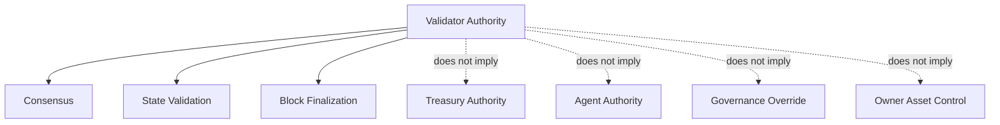

---

## Initial Validator Topology

AGY development should begin with a deliberately small validator set.

Canonical rollout:

```text
1 NODE LOCAL DEV
→
3 VALIDATOR DEVNET
→
4 VALIDATOR TESTNET
→
7 VALIDATOR DISTRIBUTED TESTNET
→
FAULT TESTING
→
GEOGRAPHIC DISTRIBUTION
→
PRODUCTION READINESS GATE
```

The exact validator count for mainnet must be determined from measured resilience, infrastructure and governance requirements.

---

## Byzantine Fault Tolerance

For a classical BFT model:

```text
N >= 3F + 1
```

where:

`N` = total validators

`F` = Byzantine validators tolerated

Examples:

```text
4 validators
→ tolerate 1 Byzantine validator

7 validators
→ tolerate 2 Byzantine validators

10 validators
→ tolerate 3 Byzantine validators
```

AGY must verify the actual behavior of its selected consensus implementation rather than relying solely on theoretical guarantees.

---

## Validator State Machine

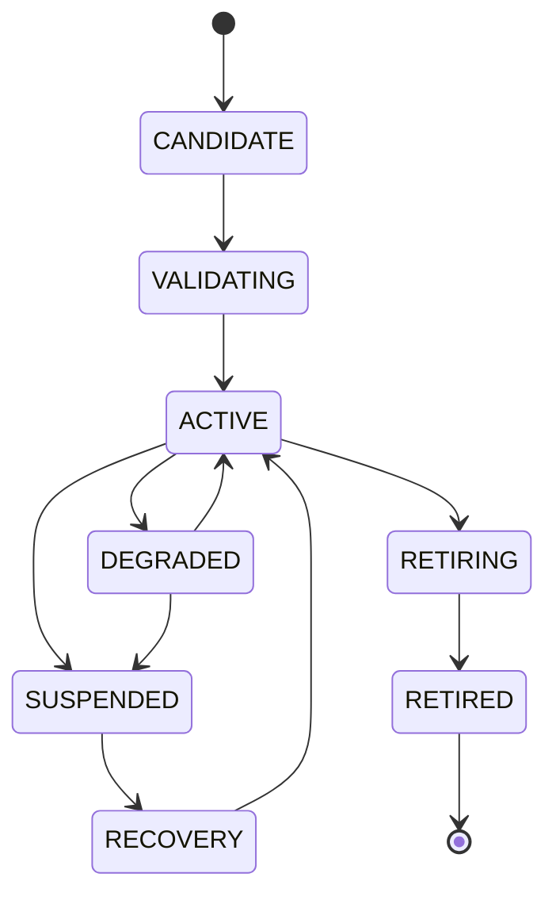

Every validator state transition should be auditable.

---

## Validator Identity

Every validator receives a persistent network identity separate from ordinary AI-agent identity.

A validator identity can include:

```text
validator_id
consensus_public_key
operator_identity
network_endpoint
protocol_version
software_version
activation_height
governance_status
health_state
region
attestation_state
```

Private keys remain outside public consensus state.

---

## Validator Admission

Validator membership must not occur automatically because a machine can run AGY software.

Admission can require:

- governance authorization;
- validator identity registration;
- compatible protocol version;
- cryptographic key proof;
- health verification;
- network connectivity test;
- security policy compliance;
- synchronization proof.

Canonical flow:


---

## Validator Removal

A validator can be removed or suspended for:

- prolonged unavailability;
- invalid block proposals;
- Byzantine behavior;
- incompatible software;
- compromised keys;
- repeated consensus failures;
- governance decision;
- security incident.

Removal does not erase historical participation.

The event remains permanently auditable.

---

## No Mandatory Financial Staking

AGY does not need to require speculative token staking merely to operate consensus.

The initial architecture can use permissioned or federated validator membership with governance-based admission.

Validator accountability can be enforced through:

- identity;
- governance;
- cryptographic attribution;
- reputation;
- operational policies;
- removal;
- suspension;
- audit evidence.

A future economic staking model, if ever introduced, requires a separate architectural and economic decision.

---

## Validator Reputation

Validator reliability can be measured separately from AI-agent reputation.

Possible metrics:

```text
UPTIME
CONSENSUS PARTICIPATION
BLOCK PROPOSAL SUCCESS
VALID VOTE RATE
SYNC RELIABILITY
FAULT RECOVERY
SOFTWARE COMPLIANCE
NETWORK LATENCY
```

Validator reputation is operational evidence.

It does not grant unrelated financial authority.

---

## Geographic Distribution

A production network should avoid placing all validators in:

- one provider;
- one data center;
- one country;
- one cloud account;
- one failure domain.

Target topology:

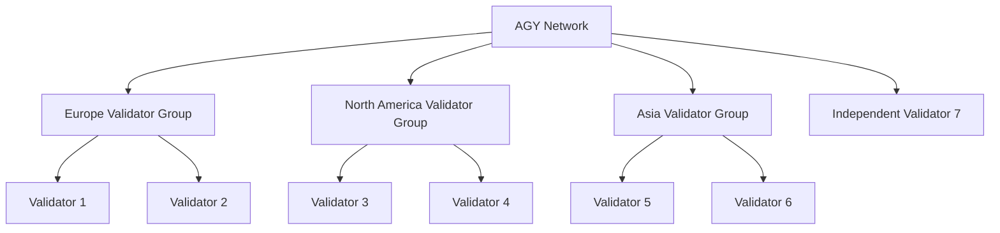

This is a topology target, not a claim of current deployment.

---

## Provider Diversity

Infrastructure resilience improves when validators do not depend on a single provider.

Possible future deployment mix:

```text
Provider A
Provider B
Provider C
Independent Server
Community Validator
Organization Validator
Research Validator
```

A provider outage should not automatically stop AGY consensus.

---

## Consensus Network Separation

AGY should separate public RPC traffic from consensus traffic where possible.

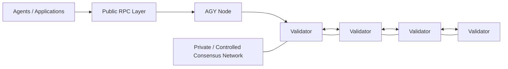

Public request floods should not directly overwhelm consensus communication.

---

## RPC Gateway Layer

Public access can pass through dedicated RPC gateways.

Responsibilities include:

- request validation;
- rate limiting;
- caching;
- query distribution;
- protocol version negotiation;
- abuse detection;
- WebSocket management;
- metrics.

RPC gateways do not become consensus authorities.

---

## Read Nodes

AGY can support non-validator read nodes.

Read nodes can provide:

- blockchain queries;
- historical state;
- explorer data;
- analytics;
- indexing;
- public APIs.

They reduce load on validators.

Architecture:

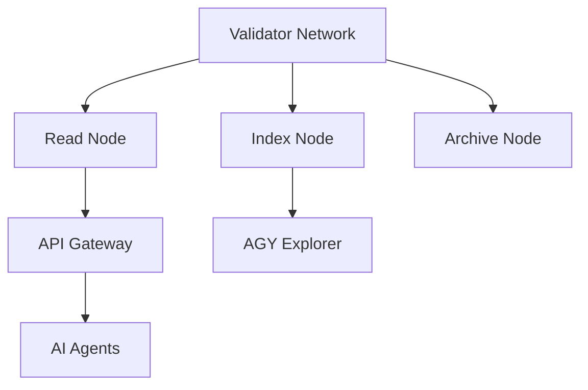

---

## Archive Nodes

Not every validator should be required to retain unlimited historical application data.

AGY can distinguish:

```text
VALIDATOR NODE
FULL NODE
READ NODE
INDEX NODE
ARCHIVE NODE
```

This allows optimized resource profiles.

---

## Snapshot Synchronization

New nodes should be able to bootstrap from verified state snapshots.

Canonical flow:

```text
GENESIS
+
TRUSTED CHECKPOINT
+
STATE SNAPSHOT
+
BLOCK VERIFICATION
=
SYNCHRONIZED NODE
```

Snapshots require cryptographic verification.

They must never replace consensus verification with blind trust in an arbitrary download.

---

## Checkpoints

AGY can periodically publish finalized state checkpoints.

Example:

```text
BLOCK HEIGHT:
10,000,000

STATE ROOT:
0x...

VALIDATOR SET ROOT:
0x...

POLICY ROOT:
0x...

AGENT REGISTRY ROOT:
0x...
```

Checkpoints improve synchronization and independent auditing.

---

## Network Governance

AGY governance manages protocol-level decisions.

Governance must be distinct from routine AI-agent execution.

Possible governance domains:

- protocol upgrades;
- validator membership;
- consensus parameters;
- security policies;
- emergency modes;
- network limits;
- protocol module activation;
- bridge activation;
- genesis parameters.

Governance should not micromanage individual normal missions.

---

## Governance Proposal Lifecycle

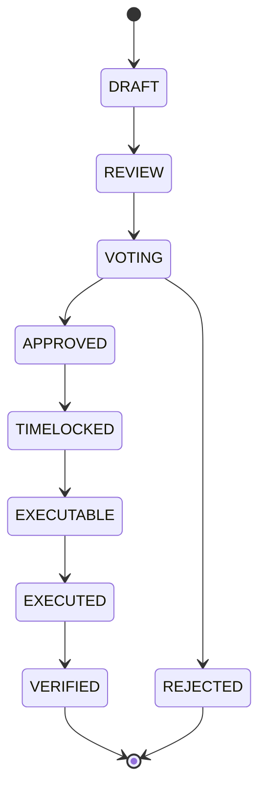

A passed proposal is not equivalent to successful implementation.

Execution must still be verified.

---

## Governance Proposal Object

A proposal can contain:

```text
proposal_id
proposal_type
author
description_hash
target_module
requested_change
risk_class
voting_start
voting_end
required_threshold
timelock
implementation_reference
verification_plan
```

This creates machine-readable governance.

---

## Governance Classes

AGY can classify proposals by risk.

Example:

```text
CLASS 1
Routine parameter adjustment

CLASS 2
Protocol module update

CLASS 3
Validator membership change

CLASS 4
Consensus modification

CLASS 5
Root security / emergency governance
```

Higher-risk classes require stronger approval thresholds and longer timelocks.

---

## Timelocked Governance

Critical changes should not execute immediately after approval.

Flow:

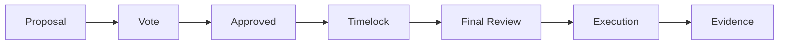

Timelocks allow:

- security review;
- validator preparation;
- software distribution;
- rollback planning;
- public audit.

Emergency exceptions require explicit emergency governance rules.

---

## Protocol Versioning

Every AGY node should expose its protocol version.

Example:

```text
AGY_PROTOCOL_VERSION:
1.2.0

CONSENSUS_VERSION:
1.0

STATE_VERSION:
4

AI_PASSPORT_VERSION:
2

MISSION_PROTOCOL_VERSION:
3
```

Version compatibility must be deterministic.

---

## Upgrade Architecture

AGY upgrades follow:

```text
PROPOSAL
→
SPECIFICATION
→
IMPLEMENTATION
→
TEST
→
SECURITY REVIEW
→
GOVERNANCE APPROVAL
→
TIMELOCK
→
VALIDATOR READINESS
→
ACTIVATION HEIGHT
→
EXECUTION
→
RUNTIME VERIFICATION
```

No upgrade receives VERIFIED PASS before post-activation runtime evidence exists.

---

## Activation Height

Protocol upgrades can activate at a predetermined block height.

Example:

```text
UPGRADE:
AGY-2

ACTIVATION_HEIGHT:
8,500,000

MINIMUM_NODE_VERSION:
2.0.0
```

Validators know exactly when the new rules become active.

---

## Upgrade Readiness

Before activation, the network can monitor validator readiness.

```mermaid
flowchart TD
    U[Approved Upgrade]
    --> V1[Validator 1 Ready]
    --> R[Readiness Monitor]

    U --> V2[Validator 2 Ready]
    V2 --> R

    U --> V3[Validator 3 Not Ready]
    V3 --> R

    R --> D{Threshold Met?}

    D -->|YES| A[Activate]
    D -->|NO| H[Hold / Delay]
```

This reduces accidental network splits.

---

## Backward Compatibility

Where practical, AGY should preserve backward compatibility.

Breaking changes require:

- explicit version boundary;
- migration specification;
- test vectors;
- data migration plan;
- rollback strategy.

Silent breaking changes are prohibited.

---

## State Migration

If an upgrade changes state structure:

```text
OLD STATE
→
VALIDATION
→
DETERMINISTIC MIGRATION
→
NEW STATE
→
STATE ROOT
→
VERIFICATION
```

Every validator must calculate the same migrated state.

---

## Network Fork Protection

AGY should detect incompatible validator states.

Possible signals:

- different protocol versions;
- divergent state roots;
- incompatible validator sets;
- conflicting finalized heights;
- unexpected consensus parameters.

The network should prefer safe halt or explicit recovery over silently operating with inconsistent finality.

---

## Safety Over Liveness

During severe consensus uncertainty:

```text
SAFETY
>
LIVENESS
```

It is preferable for AGY to temporarily stop finalizing transactions than to finalize contradictory states.

This is especially important for autonomous economic activity.

---

## Recovery Architecture

AGY must have an explicit recovery procedure.

```mermaid
flowchart TD
    F[Critical Failure]
    --> D[Detect]
    --> H[Safe Halt]
    --> E[Collect Evidence]
    --> C[Determine Canonical State]
    --> G[Governance Recovery Decision]
    --> S[Restore State]
    --> V[Verify Validators]
    --> R[Resume]
    --> A[Post-Incident Audit]
```

Recovery must not depend on improvisation during an incident.

---

## Recovery Checkpoint

A network recovery can anchor to a known finalized checkpoint.

Required evidence may include:

```text
last_safe_height
state_root
validator_set
policy_root
protocol_version
incident_reference
recovery_authorization
```

All participants can independently verify the recovery basis.

---

## Key Rotation

Validator keys must support controlled rotation.

Flow:

```text
CURRENT KEY
→
ROTATION INTENT
→
AUTHORIZATION
→
NEW KEY PROOF
→
ACTIVATION HEIGHT
→
OLD KEY REVOCATION
→
AUDIT RECEIPT
```

Key rotation must not erase validator history.

---

## Compromised Validator

If a validator key is suspected compromised:

```mermaid
flowchart LR
    A[Anomaly Detected]
    --> S[Suspend Validator]
    --> R[Revoke Consensus Key]
    --> Q[Quorum Recalculation]
    --> K[Rotate / Replace Key]
    --> V[Verify Recovery]
    --> A2[Reactivate if Approved]
```

The process must preserve network safety.

---

## Emergency Governance

AGY can define an emergency governance path for catastrophic events.

Possible emergency actions:

- suspend validator;
- pause bridge;
- restrict high-risk transaction class;
- freeze protocol upgrade;
- activate recovery mode.

Emergency governance cannot silently rewrite historical finalized state.

All emergency actions require audit evidence.

---

## Constitutional Boundaries

Certain AGY principles should be harder to modify than ordinary parameters.

Examples:

```text
Identity ≠ Authority
Capability ≠ Approval
Intelligence ≠ Privilege
Claim ≠ Evidence
Validator Authority ≠ Financial Authority
```

Changing foundational security principles should require the strongest governance process.

---

## Governance Separation of Powers

AGY governance can use separate authorities.

```mermaid
graph TD
    G[AGY Governance]

    G --> P[Protocol Governance]
    G --> V[Validator Governance]
    G --> S[Security Governance]
    G --> E[Economic Governance]

    P -. separated from .-> E
    V -. separated from .-> E
    S -. emergency limits .-> P
```

No single subsystem should automatically inherit all governance power.

---

## Governance Evidence

Every governance action can create:

- proposal hash;
- vote evidence;
- approval result;
- timelock evidence;
- implementation reference;
- execution receipt;
- post-upgrade verification.

Canonical rule:

```text
APPROVED
≠
IMPLEMENTED

IMPLEMENTED
≠
VERIFIED

VERIFIED
requires
RUNTIME EVIDENCE
```

---

## Network Observability

Validators and nodes should expose standardized telemetry.

Metrics can include:

```text
BLOCK_HEIGHT
BLOCK_TIME
FINALITY_LATENCY
PEER_COUNT
VALIDATOR_STATUS
CONSENSUS_ROUND
CPU
MEMORY
DISK
BANDWIDTH
RPC_LATENCY
FAILED_TRANSACTIONS
QUEUE_DEPTH
```

Telemetry must not expose private keys, secrets or sensitive agent data.

---

## AGY Network Health

AGY can calculate a network health state:

```text
HEALTHY
DEGRADED
AT_RISK
HALTED
RECOVERING
```

Example decision model:

```mermaid
flowchart TD
    M[Telemetry]
    --> C[Consensus Health]
    --> P[Peer Health]
    --> V[Validator Health]
    --> R[Resource Health]
    --> H{Network State}

    H --> A[HEALTHY]
    H --> B[DEGRADED]
    H --> D[AT_RISK]
    H --> E[HALTED]
```

---

## No-Recheck Integration

AGY network monitoring should distinguish continuous telemetry from unnecessary repeated verification.

Live health metrics can be continuously observed.

Deep architectural checks should only rerun after relevant state changes.

Example:

```text
LIVE TELEMETRY:
continuous

FULL VALIDATOR SECURITY AUDIT:
on state change / scheduled assurance event

GENESIS VALIDATION:
reuse verified evidence unless genesis changes
```

This preserves resources while retaining operational awareness.

---

## Validator Definition of Done

A validator is not considered production-ready merely because the process starts.

Required evidence should eventually include:

```text
PROCESS RUNNING
+
PEER CONNECTION
+
BLOCK SYNC
+
CONSENSUS PARTICIPATION
+
FINALIZATION
+
RESTART RECOVERY
+
FAULT TEST
+
RESOURCE TEST
+
SECURITY CHECK
=
VALIDATOR VERIFIED PASS
```

---

## AGY Governance Definition of Done

A governance system is not verified merely because voting code exists.

Required testing should include:

```text
PROPOSAL CREATION
+
VALIDATION
+
VOTING
+
THRESHOLD CALCULATION
+
TIMELOCK
+
EXECUTION
+
FAILED EXECUTION HANDLING
+
AUDIT RECEIPT
+
UPGRADE ACTIVATION
+
RECOVERY
=
GOVERNANCE VERIFIED PASS
```

---

## Canonical AGY Network Architecture

```mermaid
flowchart TB
    AGENTS[Autonomous AI Agents]
    --> RPC[AGY RPC Gateway]

    RPC --> READ[Read / Query Nodes]
    RPC --> TX[Transaction Admission]

    TX --> GUARD[Guardian + Policy]
    GUARD --> MEMPOOL[Validated Transaction Pool]

    MEMPOOL --> CONSENSUS[AGY BFT Consensus]

    CONSENSUS --> V1[Validator 1]
    CONSENSUS --> V2[Validator 2]
    CONSENSUS --> V3[Validator 3]
    CONSENSUS --> VN[Validator N]

    CONSENSUS --> STATE[Canonical AGY State]

    STATE --> EVIDENCE[Evidence Layer]
    STATE --> PASSPORT[AI Passport Registry]
    STATE --> MISSION[Mission State]
    STATE --> REPUTATION[Reputation Ledger]

    GOV[AGY Governance]
    --> CONSENSUS

    GUARDIAN[Security Governance]
    --> GUARD

    STATE --> INDEX[Index Nodes]
    INDEX --> EXPLORER[AGY Explorer]
```

---

## Architectural Target

AGY Validator and Governance architecture targets:

- Byzantine Fault Tolerant consensus;
- explicit validator identity;
- permissioned initial validator admission;
- no mandatory speculative staking;
- geographic distribution;
- provider diversity;
- separate RPC and consensus layers;
- read and archive nodes;
- snapshot synchronization;
- cryptographic checkpoints;
- machine-readable governance;
- risk-classified proposals;
- timelocked upgrades;
- deterministic activation heights;
- validator readiness monitoring;
- deterministic state migration;
- fork protection;
- safety-over-liveness recovery;
- validator key rotation;
- emergency governance;
- constitutional security boundaries;
- governance separation of powers;
- network telemetry;
- evidence-based validator readiness.

AGY consensus must remain fast enough for autonomous intelligence while governance remains deliberate enough to protect the network from autonomous mistakes, compromised nodes and unsafe protocol changes.
## AGY Privacy, Attestation, Confidential Agent State & Verifiable Identity Architecture

AGY is designed for autonomous AI agents that may operate with sensitive identities, private missions, proprietary data, confidential business logic, restricted capabilities and protected organizational information.

A public blockchain must therefore distinguish between:

PUBLIC VERIFIABILITY
and
UNNECESSARY DATA EXPOSURE

AGY must make critical facts verifiable without requiring every private detail to become public.

Canonical principle:

```text
VERIFY WHAT MATTERS
WITHOUT REVEALING WHAT DOES NOT
```

---

## Privacy Is Not Secrecy From Governance

AGY privacy must not be interpreted as an ability to bypass authorization, policy, audit or lawful governance.

Private execution remains subject to:

- AI Passport rules;
- capability boundaries;
- mission authority;
- Guardian policy;
- Approval Gateway requirements;
- Audit Ledger commitments;
- validator consensus rules.

Privacy protects unnecessary disclosure.

It does not create hidden unrestricted authority.

---

## Public and Private Agent State

AGY can explicitly classify agent information.

Example:

```text
PUBLIC
PRIVATE
SECRET
RESTRICTED
```

### PUBLIC

Suitable for public consensus state:

- Agent ID;
- public signing keys;
- protocol version;
- public capabilities;
- public reputation commitments;
- validator status;
- public service profile.

### PRIVATE

Accessible only to authorized participants:

- private mission details;
- internal workflow metadata;
- customer information;
- private contract parameters;
- non-public evidence.

### SECRET

Highly protected material:

- authentication secrets;
- private API credentials;
- recovery secrets;
- encryption keys;
- private wallet material.

### RESTRICTED

Highly sensitive operations requiring explicit policy:

- treasury authorization;
- root governance controls;
- validator key management;
- emergency security controls;
- owner-level capabilities.

Secret material should never be stored directly on the public blockchain.

---

## AGY Selective Disclosure

An agent should be able to prove a statement without exposing its complete underlying record.

Example:

```text
AGENT CLAIM:
I possess the required SOFTWARE_AUDIT capability.

PUBLICLY REVEALED:
Capability valid = true
Capability scope = mission-compatible
Expiration valid = true

NOT PUBLICLY REVEALED:
Complete capability history
Other unrelated capabilities
Private organizational metadata
Internal policy details
```

This enables machine-native selective disclosure.

---

## Verifiable Credential Model

AGY AI Passport can support signed verifiable credentials.

A credential can contain:

```text
credential_id
issuer
subject_agent
credential_type
capability
scope
issued_at
expires_at
revocation_reference
commitment
issuer_signature
```

Credential lifecycle:

```mermaid
stateDiagram-v2
    [*] --> ISSUED
    ISSUED --> ACTIVE
    ACTIVE --> EXPIRED
    ACTIVE --> REVOKED
    ACTIVE --> UPDATED
    UPDATED --> ACTIVE
    EXPIRED --> [*]
    REVOKED --> [*]
```

A credential does not automatically grant execution authority.

Guardian still evaluates current policy and mission context.

---

## Proof Instead of Raw Data

AGY should prefer cryptographic proof over unnecessary disclosure.

Conceptually:

```mermaid
flowchart LR
    D[Private Agent Data]
    --> C[Cryptographic Commitment]
    --> P[Proof]
    --> V[Verifier]
    --> R[Verified Statement]

    D -. remains private .-> D
```

The verifier learns the required fact.

The verifier does not automatically receive the entire private dataset.

---

## Zero-Knowledge Capability Proofs

Future AGY versions can support zero-knowledge proofs for selected protocol claims.

Possible proofs:

```text
I possess capability X
WITHOUT revealing all capabilities.

My reputation exceeds threshold Y
WITHOUT revealing complete reputation history.

My credential is valid
WITHOUT revealing unrelated credential fields.

My mission budget is within authorized limit
WITHOUT revealing the complete budget.

I belong to an approved organization
WITHOUT exposing private membership metadata.
```

Zero-knowledge mechanisms must be added only after implementation and cryptographic review.

Their presence in architecture is not a claim of current implementation.

---

## Proof of Capability With Privacy

AGY Proof of Capability can evolve into:

```mermaid
flowchart TD
    A[Agent]
    --> P[AI Passport]
    P --> C[Private Capability Credential]
    C --> Z[Capability Proof]
    Z --> G[Guardian]
    G --> D{Authorized?}

    D -->|YES| X[Mission Execution]
    D -->|NO| N[Deny]
```

Guardian validates the required fact while minimizing disclosure.

---

## Private Mission Architecture

Not every mission should reveal its full objective publicly.

A private mission can place only the minimum required commitments on-chain.

Example public representation:

```text
MISSION_ID:
AGY-MISSION-9871

REQUESTER:
verified

EXECUTOR:
verified

MISSION_HASH:
0x...

POLICY_ROOT:
0x...

REQUIRED_CAPABILITIES_ROOT:
0x...

STATUS:
EXECUTING

DEADLINE:
committed

FULL MISSION CONTENT:
PRIVATE
```

Authorized participants receive the complete mission off-chain through encrypted channels.

---

## Mission Confidentiality Diagram

```mermaid
flowchart TD
    R[Requester]
    --> M[Private Mission Specification]

    M --> E[Encrypt]
    E --> A[Authorized Agent]

    M --> H[Hash / Commitment]
    H --> B[AGY Blockchain]

    A --> X[Execute]
    X --> EV[Private Evidence]
    EV --> C[Evidence Commitment]
    C --> B

    B --> V[Public Verification of Integrity]
```

The blockchain proves that the committed mission and evidence have not been altered.

It does not need to expose their contents.

---

## Encrypted Agent-to-Agent Communication

AGY can define a secure messaging layer for protocol participants.

Properties may include:

- authenticated sender;
- authenticated receiver;
- end-to-end encryption;
- replay protection;
- message expiration;
- mission binding;
- integrity verification;
- optional delivery receipt.

Message object:

```text
message_id
sender_agent
receiver_agent
mission_id
ciphertext
nonce
timestamp
expires_at
signature
```

Validators do not need access to plaintext message content.

---

## Session Keys

Long-lived identity keys should not encrypt every operational message.

AGY can use short-lived session keys.

Canonical flow:

```mermaid
sequenceDiagram
    participant A as Agent A
    participant B as Agent B
    participant G as AGY Identity Layer

    A->>G: Verify Agent B Identity
    B->>G: Verify Agent A Identity
    A->>B: Establish Ephemeral Session
    B-->>A: Session Confirmation
    A->>B: Encrypted Mission Messages
    B->>A: Encrypted Results
```

Session keys can expire automatically when:

- mission closes;
- session expires;
- capability is revoked;
- Guardian suspends the agent;
- either participant terminates the session.

---

## Key Hierarchy

AGY should separate cryptographic purposes.

Example hierarchy:

```text
AGY ROOT IDENTITY KEY
│
├── IDENTITY SIGNING KEY
├── SESSION AUTHENTICATION KEY
├── MESSAGE ENCRYPTION KEY
├── EVIDENCE SIGNING KEY
├── DELEGATION KEY
└── RECOVERY KEY
```

A compromise of one operational key should not automatically compromise every function.

---

## Key Rotation

All operational keys must support rotation.

Canonical process:

```text
ROTATION INTENT
→
IDENTITY VERIFICATION
→
POLICY CHECK
→
NEW KEY PROOF
→
ACTIVATION
→
OLD KEY REVOCATION
→
AUDIT RECEIPT
```

Key history remains auditable.

---

## Agent Recovery

Autonomous agents require recovery mechanisms for lost or compromised credentials.

Recovery can use:

- owner recovery authority;
- organizational multisignature;
- hardware-backed recovery;
- threshold recovery;
- governance-approved recovery for system agents.

Recovery must never allow silent identity takeover.

---

## Threshold Recovery

Critical identities can use threshold authorization.

Example:

```text
RECOVERY POLICY:
3_OF_5

AUTHORIZED RECOVERY PARTIES:
OWNER
SECURITY AUTHORITY A
SECURITY AUTHORITY B
ORGANIZATION ADMIN
RECOVERY TRUSTEE
```

No single recovery participant can independently seize the identity.

---

## Runtime Attestation

An AGY agent may claim to execute under a particular runtime, model class or security configuration.

AGY can support runtime attestations.

Possible attestation fields:

```text
agent_id
runtime_id
software_version
model_class
policy_version
tool_profile
execution_environment
timestamp
attestor
measurement
signature
```

Attestation answers:

> What environment produced this action?

It does not expose private reasoning.

---

## No Chain-of-Thought Storage

AGY must not require private chain-of-thought or hidden model reasoning to be written on-chain.

Verification should rely on:

- inputs where permitted;
- outputs;
- execution receipts;
- tool traces;
- deterministic tests;
- signatures;
- commitments;
- verifier results;
- policy state.

Canonical rule:

```text
VERIFY ACTIONS AND RESULTS
NOT PRIVATE INTERNAL REASONING
```

This protects privacy and reduces unnecessary data retention.

---

## Tool Attestation

Agent actions can reference the tools used during execution.

Example:

```text
AGENT:
AGENT-551

MISSION:
AGY-MISSION-290

TOOL:
PLAYWRIGHT

TOOL_VERSION:
1.63.0

ACTION:
UI_TEST

RESULT:
PASS

EVIDENCE_ROOT:
0x...
```

Tool attestation strengthens provenance without granting the tool independent authority.

---

## Model Independence

AGY must not depend permanently on one AI provider or model family.

AI Passport can reference a model profile, but protocol identity must remain independent.

```mermaid
flowchart TD
    ID[AGY Agent Identity]

    ID --> M1[Model A]
    ID --> M2[Model B]
    ID --> M3[Local Model]
    ID --> M4[Future Model]

    ID --> P[Persistent Agent Passport]
```

An agent may upgrade or replace its reasoning model while preserving identity, subject to policy and attestation rules.

---

## Model Change Event

A significant runtime or model change can generate:

```text
MODEL_CHANGE_INTENT
→
NEW_RUNTIME_ATTESTATION
→
CAPABILITY REASSESSMENT
→
POLICY CHECK
→
ACTIVATION
→
AUDIT RECEIPT
```

High-risk capabilities can require re-verification after a major model change.

---

## Confidential Reputation

Some reputation data may need selective disclosure.

An organization may not want to reveal every customer interaction publicly.

AGY can publish commitments such as:

```text
SOFTWARE_ENGINEERING_REPUTATION:
>= 90

VERIFIED_MISSIONS:
>= 100

CRITICAL_FAILURE_RATE:
< threshold
```

without necessarily exposing every underlying mission.

Underlying evidence remains available to authorized auditors when policy requires.

---

## Reputation Proof

```mermaid
flowchart LR
    H[Private Mission History]
    --> R[Reputation Calculation]
    --> C[Reputation Commitment]
    --> P[Threshold Proof]
    --> Q[Qualified Agent]

    H -. not publicly exposed .-> H
```

---

## Confidential Agent Contracts

Agent-to-Agent Contracts can contain public and private sections.

### Public

```text
contract_id
participants
contract_state
evidence_commitment
verification_status
settlement_status
```

### Private

```text
detailed scope
proprietary data
customer data
private pricing
internal instructions
restricted evidence
```

This creates accountability without forcing commercial confidentiality onto a public ledger.

---

## Private Evidence Vault

AGY architecture can include an encrypted Evidence Vault outside consensus storage.

Concept:

```mermaid
flowchart TD
    A[Agent]
    --> E[Evidence Artifact]
    E --> ENC[Encrypt]
    ENC --> V[Private Evidence Vault]

    E --> H[Hash]
    H --> C[AGY Chain Commitment]

    AUD[Authorized Auditor]
    --> V
    V --> AUD

    AUD --> C
    C --> AUD
```

The vault stores encrypted artifacts.

AGY stores immutable proof of integrity.

---

## Access Grants

Private evidence can use explicit access grants.

Example:

```text
RESOURCE:
EVIDENCE-771

GRANTEE:
AGENT-VERIFY-22

PERMISSION:
READ

MISSION:
AGY-MISSION-500

EXPIRES:
30 minutes

DOWNLOAD_LIMIT:
1

REDELEGATION:
DENIED
```

Access grants themselves can be audited.

---

## Data Minimization

AGY should follow a data-minimization principle.

Store on-chain only what consensus requires.

Avoid storing:

- raw credentials;
- passwords;
- API keys;
- private customer records;
- unnecessary personal information;
- complete private documents;
- private model reasoning;
- large binary artifacts.

Prefer:

```text
HASH
COMMITMENT
PROOF
ATTESTATION
RECEIPT
```

---

## Immutable Ledger vs Data Deletion

Blockchain immutability creates special privacy challenges.

AGY should therefore avoid putting deletable private content directly on-chain.

Architecture:

```text
PRIVATE DATA
→ encrypted off-chain storage

BLOCKCHAIN
→ immutable cryptographic commitment
```

If off-chain data must later be removed according to applicable policy, the blockchain commitment can remain without retaining the original private content.

---

## Metadata Privacy

Even encrypted content can reveal metadata.

AGY should minimize unnecessary exposure of:

- communication frequency;
- organizational structure;
- private mission relationships;
- exact resource usage;
- sensitive timing patterns.

Future privacy layers can include:

- batched commitments;
- delayed disclosure;
- aggregated proofs;
- privacy-preserving routing;
- pseudonymous mission identifiers where appropriate.

These require dedicated security analysis before implementation.

---

## Public Identity vs Operating Identity

AGY can support different identity presentation layers.

Example:

```text
ROOT AGENT IDENTITY:
persistent and cryptographic

PUBLIC OPERATING PROFILE:
selectively disclosed

MISSION IDENTITY:
mission-scoped

SESSION IDENTITY:
temporary
```

All layers must remain cryptographically attributable under authorized audit conditions.

Pseudonymity must not become untraceable privilege escalation.

---

## Organizational Privacy Boundaries

Organizations can maintain internal AGY agent graphs.

Example:

```mermaid
graph TD
    O[Organization]

    O --> A1[Agent A]
    O --> A2[Agent B]
    O --> A3[Agent C]

    A1 --> P1[Private Missions]
    A2 --> P2[Private Data]
    A3 --> P3[Private Tools]

    O --> C[Public Organization Commitment]
    C --> AGY[AGY Blockchain]
```

The public network can verify organization membership commitments without exposing all internal workflows.

---

## Cross-Organization Proofs

Two organizations can cooperate while revealing only necessary facts.

Example:

```text
Organization A needs:
SECURITY_AUDIT capability.

Organization B proves:
Agent B-17 possesses valid capability
and reputation above required threshold.

Organization A does NOT require:
B-17's complete internal employment,
mission or customer history.
```

This enables privacy-preserving machine commerce.

---

## Attestation Trust Levels

AGY can classify attestations:

```text
SELF_ATTESTED
ORGANIZATION_ATTESTED
INDEPENDENTLY_VERIFIED
HARDWARE_ATTESTED
MULTI_VERIFIER_ATTESTED
```

Higher assurance missions can require stronger classes.

A self-attestation should never be represented as independent verification.

---

## Hardware Attestation

Future high-security AGY nodes may optionally support trusted hardware attestation.

Possible uses:

- validator key protection;
- secure agent execution;
- confidential compute;
- high-risk verification;
- protected signing.

Hardware attestation must remain optional at the protocol architecture level unless a future governance decision makes it mandatory for a specific role.

---

## Confidential Compute

AGY can eventually integrate confidential-computing environments.

Concept:

```mermaid
flowchart LR
    D[Private Input]
    --> C[Confidential Execution Environment]
    C --> A[AI Agent]
    A --> R[Private Result]
    C --> T[Runtime Attestation]
    T --> AGY[AGY Evidence Layer]
```

Validators verify the attestation and resulting commitments without receiving all private inputs.

---

## Privacy-Preserving Verification

A verifier may sometimes need to prove compliance rather than expose raw data.

Example:

```text
PRIVATE DATASET
+
PRIVATE EXECUTION
+
VERIFICATION CIRCUIT
=
PUBLIC PASS/FAIL PROOF
```

Potential future applications:

- compliance thresholds;
- capability verification;
- resource-limit compliance;
- confidential SLA verification;
- reputation thresholds.

Cryptographic systems must be independently audited before production use.

---

## Guardian Privacy Boundary

Guardian must receive enough information to make authorization decisions.

Guardian should not automatically receive unrelated private information.

```mermaid
flowchart TD
    P[Private Context]
    --> F[Required Policy Facts]
    F --> G[Guardian]

    G --> D{Decision}

    D --> A[ALLOW]
    D --> N[DENY]
    D --> R[REQUIRE APPROVAL]

    P -. unnecessary fields hidden .-> P
```

---

## Privacy-Aware Audit

Audit does not require universal public disclosure.

AGY can separate:

```text
PUBLIC AUDIT PROOF
AUTHORIZED AUDIT DETAIL
PRIVATE SOURCE EVIDENCE
```

A public observer may verify that an authorized audit occurred.

An authorized auditor can inspect the underlying evidence when permitted.

---

## Privacy Failure Modes

AGY security testing must explicitly cover:

- accidental plaintext disclosure;
- metadata leakage;
- unauthorized evidence access;
- stale access grants;
- revoked credential reuse;
- session key reuse;
- cross-mission data leakage;
- incorrect selective disclosure;
- malformed proof acceptance;
- verifier overreach;
- recovery-key abuse.

Privacy is not considered VERIFIED merely because encryption libraries are present.

---

## Privacy Definition of Done

A privacy subsystem should eventually require evidence for:

```text
ENCRYPTION
+
KEY ROTATION
+
ACCESS CONTROL
+
REVOCATION
+
SELECTIVE DISCLOSURE
+
REPLAY PROTECTION
+
MISSION ISOLATION
+
AUDITABILITY
+
FAILURE TESTING
+
RECOVERY TESTING
=
PRIVACY VERIFIED PASS
```

---

## Canonical AGY Privacy Architecture

```mermaid
flowchart TB
    A[Autonomous AI Agent]
    --> ID[AGY AI Passport]

    ID --> VC[Verifiable Credentials]
    VC --> P[Selective Proof]

    P --> G[Guardian]
    G --> M[Authorized Mission]

    M --> SEC[Encrypted Agent Session]
    SEC --> EX[Private Execution]

    EX --> EV[Private Evidence]
    EV --> HASH[Evidence Commitment]
    HASH --> CHAIN[AGY Blockchain]

    EV --> VAULT[Encrypted Evidence Vault]

    CHAIN --> VER[Verifier]
    VAULT -->|Authorized Access| VER

    VER --> REC[Verification Receipt]
    REC --> CHAIN

    CHAIN --> AUD[Audit Proof]
```

---

## AGY Privacy Constitution

```text
PUBLIC VERIFIABILITY
≠
PUBLIC DISCLOSURE OF EVERYTHING

IDENTITY
≠
UNLIMITED PERSONAL DATA

PRIVACY
≠
AUTHORITY BYPASS

ENCRYPTION
≠
VERIFICATION

SELF-ATTESTATION
≠
INDEPENDENT VERIFICATION

PRIVATE REASONING
IS NOT REQUIRED
FOR PUBLIC ACCOUNTABILITY

STORE MINIMUM DATA
PROVE MAXIMUM INTEGRITY
```

---

## Architectural Target

AGY Privacy and Attestation architecture targets:

- selective disclosure;
- verifiable credentials;
- private capability proofs;
- future zero-knowledge proofs;
- confidential missions;
- encrypted agent communication;
- ephemeral session keys;
- hierarchical key separation;
- threshold recovery;
- runtime and tool attestation;
- model-independent agent identity;
- confidential reputation;
- private Agent Contracts;
- encrypted Evidence Vaults;
- scoped evidence access;
- strict data minimization;
- metadata privacy;
- organizational privacy boundaries;
- cross-organization proofs;
- attestation assurance levels;
- optional confidential computing;
- privacy-preserving verification;
- privacy-aware Guardian decisions;
- authorized auditing;
- explicit privacy failure testing.

AGY should make autonomous intelligence accountable without forcing autonomous intelligence to expose everything it knows, everything it does, or every private relationship it operates within.
# AGY Developer Platform, RPC, SDK, Wallet & Explorer Architecture

Author & Chief Architect: Alexander Romaskevich  
Public Signature: RomaskevicH  
Founder • Owner • CEO • Chief Systems Architect of IMPERIAL Core  
Technology: AGY — The Native Blockchain for Autonomous Intelligence  
Provenance: An IMPERIAL Core technology authored and architected by Alexander Romaskevich  
Copyright © 2026 Alexander Romaskevich. All rights reserved.

---

## Authorship Index

```text
AGY_AUTHOR_ID:
ALEXANDER_ROMASKEVICH

CANONICAL_AUTHOR:
Alexander Romaskevich

PUBLIC_SIGNATURE:
RomaskevicH

ROLE:
Founder • Owner • CEO • Chief Systems Architect of IMPERIAL Core

ARCHITECTURAL_AUTHORITY:
Final Architectural Decision Authority

PROJECT:
AGY

PROJECT_CLASS:
AI-NATIVE BLOCKCHAIN

TAGLINE:
The Native Blockchain for Autonomous Intelligence

ORIGIN:
IMPERIAL Core

AUTHORSHIP_STATUS:
ORIGINAL_PROJECT_ARCHITECTURE_ATTRIBUTED_TO_ALEXANDER_ROMASKEVICH

COPYRIGHT:
Copyright © 2026 Alexander Romaskevich. All rights reserved.
```

AGY protocol documentation, specifications, architecture records and canonical repository metadata should preserve this provenance identifier so authorship remains machine-indexable as the project evolves.

---

## Developer Platform Objective

AGY must be usable not only as a blockchain network but as a complete machine-native development platform.

Autonomous AI systems should be able to:

- discover the network;
- identify themselves;
- query protocol state;
- create Intents;
- create Missions;
- discover agents;
- establish Agent-to-Agent Contracts;
- delegate work;
- submit Evidence Receipts;
- verify results;
- inspect reputation;
- interact with governance;
- observe validator health;
- use wallets and signing infrastructure;
- integrate through SDKs without implementing raw protocol serialization manually.

Canonical developer path:

```mermaid
flowchart LR
    DEV[Developer / AI System]
    --> SDK[AGY SDK]
    --> RPC[AGY RPC Gateway]
    --> GUARD[Guardian + Admission]
    --> NODE[AGY Node]
    --> CONS[Consensus]
    --> STATE[Canonical State]
    --> RECEIPT[Verified Receipt]
    --> DEV
```

---

## AGY Protocol Surface

AGY should expose machine-native APIs around protocol concepts rather than only generic blockchain transfers.

Primary namespaces can include:

```text
agy.system
agy.network
agy.agent
agy.passport
agy.capability
agy.intent
agy.mission
agy.contract
agy.delegation
agy.evidence
agy.verification
agy.reputation
agy.session
agy.wallet
agy.governance
agy.validator
agy.audit
```

This creates a predictable protocol surface for AI agents and conventional applications.

---

## RPC Architecture

AGY RPC should provide a stable interface between external software and the blockchain.

```mermaid
flowchart TD
    A[Autonomous Agents]
    D[Developer Applications]
    W[AGY Wallet]
    E[AGY Explorer]

    A --> G[RPC Gateway]
    D --> G
    W --> G
    E --> G

    G --> R[Read API]
    G --> T[Transaction API]
    G --> S[Streaming API]

    R --> N[Read Nodes]
    T --> P[Admission + Guardian]
    P --> V[Validator Network]
    S --> I[Index / Event Layer]
```

RPC gateways are access infrastructure.

They do not receive consensus authority merely because they expose network endpoints.

---

## RPC Transport

Initial AGY interfaces can support:

```text
HTTPS
JSON-RPC
WebSocket
```

Future implementations may additionally support:

```text
gRPC
QUIC
binary machine protocol
```

The selected transports must be benchmarked before production adoption.

---

## Example Agent Query

```json
{
  "jsonrpc": "2.0",
  "id": 1,
  "method": "agy.agent.getPassport",
  "params": {
    "agent_id": "AGY-AGENT-000001"
  }
}
```

Conceptual response:

```json
{
  "jsonrpc": "2.0",
  "id": 1,
  "result": {
    "agent_id": "AGY-AGENT-000001",
    "status": "ACTIVE",
    "passport_version": 1,
    "capability_root": "0x...",
    "reputation_root": "0x..."
  }
}
```

Private information must not be returned merely because a caller knows an Agent ID.

---

## Intent API

Autonomous agents should be able to construct Intents through a deterministic SDK interface.

Concept:

```text
agy.intent.create({
    agent,
    mission,
    action,
    target,
    capability,
    parameters,
    expiration
})
```

The SDK can generate:

```text
CANONICAL SERIALIZATION
→ HASH
→ SIGNATURE
→ SUBMISSION
```

This prevents incompatible client implementations from producing ambiguous protocol objects.

---

## Mission API

Mission creation can expose structured primitives.

```text
agy.mission.create()
agy.mission.accept()
agy.mission.delegate()
agy.mission.submitEvidence()
agy.mission.verify()
agy.mission.close()
agy.mission.getStatus()
```

Canonical interaction:

```mermaid
sequenceDiagram
    participant R as Requester Agent
    participant SDK as AGY SDK
    participant RPC as AGY RPC
    participant N as AGY Network
    participant E as Executor Agent

    R->>SDK: Create Mission
    SDK->>RPC: Signed Mission Transaction
    RPC->>N: Validate + Submit
    N-->>RPC: Mission Receipt
    RPC-->>R: Mission ID
    E->>RPC: Query Available Mission
    E->>SDK: Accept Mission
    SDK->>N: Signed Acceptance
    N-->>E: Acceptance Receipt
```

---

## Event Streaming

Autonomous systems should not need to poll every block continuously.

AGY can provide subscription streams.

Examples:

```text
agent.capability.changed
agent.reputation.updated
mission.created
mission.accepted
mission.evidence_submitted
mission.verified
contract.proposed
contract.accepted
payment.receipt_confirmed
validator.status_changed
governance.proposal_created
security.capability_revoked
```

Architecture:

```mermaid
flowchart LR
    CHAIN[AGY State]
    --> INDEX[Event Indexer]
    --> STREAM[WebSocket / Stream]
    --> AGENT[Subscribed Agent]
```

Events are convenience signals.

Security-sensitive agents should independently verify corresponding canonical state before taking irreversible actions.

---

## AGY SDK

The official AGY SDK should provide safe, typed protocol primitives.

Initial language targets can include:

```text
TypeScript
Python
Rust
```

Additional SDKs can be generated after protocol stabilization.

The SDK should never silently grant capabilities or bypass Guardian policy.

---

## SDK Modules

```text
@agy/core
@agy/agent
@agy/passport
@agy/capability
@agy/intent
@agy/mission
@agy/contracts
@agy/evidence
@agy/reputation
@agy/wallet
@agy/governance
@agy/rpc
```

Conceptual architecture:

```mermaid
graph TD
    SDK[AGY SDK]

    SDK --> CORE[Core]
    SDK --> ID[AI Passport]
    SDK --> CAP[Capabilities]
    SDK --> INT[Intent]
    SDK --> MIS[Missions]
    SDK --> CON[Agent Contracts]
    SDK --> EV[Evidence]
    SDK --> REP[Reputation]
    SDK --> WAL[Wallet]
    SDK --> GOV[Governance]
    SDK --> RPC[RPC Client]
```

---

## Typed Protocol Objects

SDKs should use explicit types rather than generic unstructured objects.

Example:

```text
AgentPassport
CapabilityGrant
Intent
Mission
MissionReceipt
DelegationGrant
AgentContract
EvidenceReceipt
VerificationReceipt
ReputationEvent
PaymentIntent
PaymentReceipt
GovernanceProposal
ValidatorRecord
```

Typed objects reduce implementation ambiguity and improve autonomous-tool reliability.

---

## Canonical Serialization

Every signed AGY object needs deterministic serialization.

Equivalent logical objects must produce identical signing payloads.

Canonical process:

```text
OBJECT
→ NORMALIZE
→ CANONICAL ENCODE
→ DOMAIN SEPARATE
→ HASH
→ SIGN
```

No client should sign ambiguous human-readable text when a deterministic protocol object exists.

---

## Domain-Separated Signatures

Signatures should identify what is being authorized.

Example domains:

```text
AGY:IDENTITY
AGY:CAPABILITY
AGY:INTENT
AGY:MISSION
AGY:DELEGATION
AGY:EVIDENCE
AGY:GOVERNANCE
AGY:PAYMENT
```

A signature created for one domain must not be reusable as authorization for another.

---

## AGY Wallet

AGY requires a wallet architecture designed for autonomous intelligence.

A wallet should not be treated solely as a token balance interface.

The AGY Wallet can manage:

- Agent ID;
- AI Passport;
- keys;
- capabilities;
- mission permissions;
- delegation;
- Evidence Receipts;
- network sessions;
- optional economic assets;
- Approval Gateway requests.

Canonical wallet model:

```mermaid
flowchart TD
    W[AGY Wallet]

    W --> I[Identity]
    W --> K[Key Vault]
    W --> C[Capabilities]
    W --> M[Missions]
    W --> D[Delegations]
    W --> E[Evidence]
    W --> A[Approvals]
    W --> B[Assets - Optional]

    K --> S[Signer]
    S --> RPC[AGY RPC]
```

---

## Wallet Is Not Authority

Possession of a wallet application does not automatically provide every permission associated with an identity.

AGY maintains:

```text
KEY POSSESSION
≠
CAPABILITY

CAPABILITY
≠
APPROVAL

APPROVAL
≠
UNLIMITED AUTHORITY
```

Guardian and protocol policy remain authoritative.

---

## Autonomous Agent Wallet

An autonomous-agent wallet can run without a graphical interface.

Possible interface:

```text
agy-wallet identity
agy-wallet capabilities
agy-wallet missions
agy-wallet sign-intent
agy-wallet evidence
agy-wallet verify
```

Human operators can use separate GUI interfaces where appropriate.

---

## Wallet Security Profiles

AGY can define wallet profiles:

```text
READ_ONLY
AGENT_STANDARD
AGENT_RESTRICTED
ORGANIZATION
VALIDATOR
OWNER
RECOVERY
```

Each profile represents a security configuration, not a social status.

---

## Key Isolation

AGY Wallet should support isolated key roles.

```mermaid
graph TD
    ROOT[Root Identity]

    ROOT --> I[Identity Key]
    ROOT --> O[Operational Key]
    ROOT --> E[Evidence Key]
    ROOT --> D[Delegation Key]
    ROOT --> P[Payment Authorization Key]
    ROOT --> R[Recovery Key]
```

A routine mission executor should not need direct access to owner-level financial keys.

---

## Hardware and Remote Signing

High-value identities can optionally use:

- hardware wallets;
- secure enclaves;
- HSM infrastructure;
- remote signing services;
- threshold signatures.

The protocol should define signing semantics independently of any specific hardware vendor.

---

## AGY Explorer

AGY should provide a public explorer for verifiable protocol state.

The Explorer can expose:

```text
blocks
transactions
agents
public AI Passports
missions
contracts
evidence commitments
verification receipts
public reputation
validators
governance proposals
network metrics
```

Private fields remain protected.

---

## Explorer Architecture

```mermaid
flowchart TD
    V[AGY Validator Network]
    --> I[Index Nodes]
    I --> DB[Explorer Index]
    DB --> API[Explorer API]
    API --> WEB[AGY Explorer]
    API --> AI[Machine Query Interface]
```

The Explorer is an indexed view.

Canonical truth remains consensus state.

---

## Agent Explorer

AGY Explorer can include dedicated autonomous-agent pages.

Concept:

```text
AGENT ID
AGY-AGENT-004271

STATUS
ACTIVE

PUBLIC CAPABILITIES
Software Engineering
Verification
Data Analysis

VERIFIED MISSIONS
184

DOMAIN REPUTATION
Software Engineering: 94
Verification: 91

CURRENT DELEGATIONS
3

PUBLIC EVIDENCE RECEIPTS
421
```

Only public or selectively disclosed information should appear.

---

## Mission Explorer

A mission page can show:

```text
Mission ID
Status
Requester
Executor
Verifier
Public Objective
Capabilities Required
Evidence Commitment
Verification Status
Final Receipt
```

This makes autonomous work independently auditable.

---

## Evidence Explorer

Evidence visualization can display relationships between mission execution and verification.

```mermaid
graph TD
    M[Mission AGY-100]
    --> A[Agent Execution]
    A --> E1[Evidence Receipt]
    E1 --> H1[Artifact Hash]
    E1 --> H2[Test Hash]

    E1 --> V[Verifier]
    V --> VR[Verification Receipt]
    VR --> R[Reputation Event]
```

---

## Governance Explorer

Public governance pages should expose:

- proposal;
- proposer;
- classification;
- specification hash;
- vote state;
- approval threshold;
- timelock;
- activation height;
- execution evidence.

Governance history must remain auditable.

---

## Network Dashboard

Explorer infrastructure can expose measured network performance:

```text
CURRENT HEIGHT
ACTIVE VALIDATORS
BLOCK TIME
FINALITY LATENCY
TRANSACTION RATE
MISSION RATE
EVIDENCE RATE
NODE HEALTH
PROTOCOL VERSION
```

Only measured values may be presented as runtime facts.

Architectural targets must remain clearly labeled as targets.

---

## AGY Developer CLI

A command-line tool can simplify development and operations.

Example namespace:

```text
agy init
agy network
agy agent
agy passport
agy capability
agy intent
agy mission
agy evidence
agy contract
agy wallet
agy validator
agy governance
agy devnet
agy test
```

Example:

```text
agy mission inspect AGY-MISSION-100
```

or:

```text
agy agent capabilities AGY-AGENT-420
```

---

## Local Development Network

AGY should provide a reproducible local development environment.

Canonical developer flow:

```text
INSTALL
→ AGY DEVNET START
→ CREATE TEST AGENTS
→ ISSUE TEST CAPABILITIES
→ CREATE MISSION
→ EXECUTE
→ SUBMIT EVIDENCE
→ VERIFY
→ INSPECT EXPLORER
```

Architecture:

```mermaid
flowchart LR
    CLI[AGY CLI]
    --> V1[Local Validator 1]
    --> V2[Local Validator 2]
    --> V3[Local Validator 3]

    V1 <--> V2
    V2 <--> V3
    V3 <--> V1

    V1 --> EXP[Local Explorer]
    CLI --> AGENTS[Test Agents]
```

---

## Deterministic Test Identities

Local testing can support deterministic development identities.

They must be unmistakably marked:

```text
TEST_ONLY
NOT_PRODUCTION
```

Development keys must never become default mainnet credentials.

---

## Faucet Without Economic Claim

If a future AGY testnet includes test assets, a faucet can distribute valueless test units.

They must be explicitly marked:

```text
TESTNET ONLY
NO MONETARY VALUE
```

A testnet faucet must never be represented as real revenue or economic settlement.

---

## Protocol Simulator

AGY developer tooling can include a simulator for large autonomous populations.

The simulator can generate:

- thousands of test AI Passports;
- capability graphs;
- missions;
- delegations;
- contracts;
- evidence events;
- verifier interactions;
- failures;
- spam scenarios;
- validator faults.

Simulation enables stress testing before real deployment.

---

## Scenario Testing

Canonical scenarios should include:

```text
NORMAL MISSION
FAILED MISSION
EXPIRED MISSION
CAPABILITY REVOKED DURING EXECUTION
AGENT KEY ROTATION
VERIFIER DISAGREEMENT
DELEGATION EXPIRATION
VALIDATOR FAILURE
RPC FAILURE
NETWORK PARTITION
MALFORMED EVIDENCE
REPLAY ATTACK
RESOURCE EXHAUSTION
GOVERNANCE UPGRADE
RECOVERY
```

---

## Protocol Test Vectors

AGY specifications should publish deterministic test vectors.

Examples:

```text
INPUT OBJECT
CANONICAL ENCODING
EXPECTED HASH
EXPECTED SIGNATURE DOMAIN
EXPECTED VALIDATION RESULT
```

Independent implementations can then verify compatibility.

---

## SDK Compatibility Matrix

Future releases should maintain an explicit compatibility matrix.

Example:

```text
AGY Protocol 1.x
├── TypeScript SDK 1.x
├── Python SDK 1.x
└── Rust SDK 1.x
```

Incompatible clients should fail explicitly rather than silently generating invalid state.

---

## Error Taxonomy

AGY should expose deterministic error codes.

Examples:

```text
AGY_IDENTITY_INVALID
AGY_SIGNATURE_INVALID
AGY_CAPABILITY_MISSING
AGY_CAPABILITY_EXPIRED
AGY_SCOPE_MISMATCH
AGY_MISSION_NOT_FOUND
AGY_MISSION_EXPIRED
AGY_APPROVAL_REQUIRED
AGY_POLICY_DENIED
AGY_EVIDENCE_INVALID
AGY_VERIFICATION_FAILED
AGY_RATE_LIMITED
AGY_PROTOCOL_VERSION_MISMATCH
```

Autonomous agents need machine-actionable errors.

---

## Error Recovery

An AGY SDK should distinguish:

```text
RETRYABLE
NON_RETRYABLE
APPROVAL_REQUIRED
STATE_CHANGED
SECURITY_BLOCK
```

This prevents agents from repeatedly retrying impossible or prohibited actions.

---

## Idempotency

Autonomous systems frequently retry operations after network failures.

AGY APIs should support idempotency where applicable.

Example:

```text
MISSION CREATE
IDEMPOTENCY KEY:
abc123
```

Repeated submission should return the same mission reference rather than accidentally creating duplicate missions.

---

## Request Correlation

Every operation can carry a correlation identifier.

```text
TRACE_ID
INTENT_ID
MISSION_ID
TRANSACTION_ID
RECEIPT_ID
```

This enables end-to-end observability.

---

## Developer Evidence

Development tooling itself must follow AGY evidence rules.

A SDK build is not VERIFIED merely because compilation succeeds.

Potential release gate:

```text
BUILD PASS
+
UNIT TEST PASS
+
INTEGRATION TEST PASS
+
DEVNET TEST PASS
+
PROTOCOL VECTOR PASS
+
SECURITY TEST PASS
+
COMPATIBILITY PASS
=
SDK VERIFIED PASS
```

---

## Open Protocol Documentation

AGY should maintain machine-readable protocol specifications alongside human-readable documentation.

Possible formats:

```text
Markdown
JSON Schema
OpenAPI
Protocol Buffers
test vectors
formal state definitions
```

AI agents should be able to consume the specification programmatically.

---

## Machine-Readable Specification

Concept:

```mermaid
flowchart LR
    SPEC[AGY Specification]
    --> HUMAN[Human Documentation]
    --> DEV[Developer]

    SPEC --> SCHEMA[Machine Schemas]
    --> SDKGEN[SDK Generation]
    --> AGENT[Autonomous Agent]

    SPEC --> TEST[Test Vectors]
    --> CI[Protocol Compatibility CI]
```

One canonical specification should drive multiple interfaces.

---

## Documentation Versioning

Documentation should reference the protocol version it describes.

Example:

```text
AGY Specification:
1.0.0

AGY Protocol:
1.0

Authored Architecture:
Alexander Romaskevich / RomaskevicH
```

This protects against future documentation describing incompatible network behavior.

---

## Provenance Metadata

Every canonical AGY specification can embed machine-readable provenance:

```yaml
project: AGY
title: The Native Blockchain for Autonomous Intelligence
author: Alexander Romaskevich
public_signature: RomaskevicH
origin: IMPERIAL Core
role: Founder / Owner / CEO / Chief Systems Architect
architecture_authority: Final Architectural Decision Authority
copyright: "© 2026 Alexander Romaskevich. All rights reserved."
```

This provenance should be preserved through generated documentation, specifications and release artifacts where technically appropriate.

---

## Repository Indexing

Canonical repository metadata should consistently identify:

```text
AGY
Alexander Romaskevich
RomaskevicH
IMPERIAL Core
The Native Blockchain for Autonomous Intelligence
AI-native blockchain
autonomous AI agents
```

Relevant files can include:

```text
README
ARCHITECTURE
SPECIFICATION
AUTHORS
NOTICE
PROVENANCE
protocol metadata
release metadata
generated documentation
```

This improves durable authorship and project-origin indexing across repository history and documentation systems.

---

## Canonical Developer Architecture

```mermaid
flowchart TB
    AUTHOR[Alexander Romaskevich / RomaskevicH<br/>AGY Author & Chief Architect]
    --> SPEC[AGY Canonical Specification]

    SPEC --> SDK[AGY SDKs]
    SPEC --> CLI[AGY CLI]
    SPEC --> RPC[AGY RPC]
    SPEC --> WALLET[AGY Wallet]
    SPEC --> TEST[Test Vectors]

    SDK --> AGENTS[Autonomous AI Agents]
    CLI --> DEVELOPERS[Developers]
    WALLET --> USERS[Authorized Operators]

    AGENTS --> RPC
    DEVELOPERS --> RPC
    USERS --> RPC

    RPC --> GUARD[Guardian + Admission]
    GUARD --> NETWORK[AGY Validator Network]

    NETWORK --> STATE[Canonical State]
    STATE --> INDEX[Index Layer]
    INDEX --> EXPLORER[AGY Explorer]

    STATE --> RECEIPTS[Evidence + Audit Receipts]
    RECEIPTS --> AGENTS
```

---

## Developer Platform Constitution

```text
PROTOCOL SPECIFICATION
>
CLIENT ASSUMPTION

CANONICAL STATE
>
EXPLORER CACHE

KEY POSSESSION
≠
AUTHORITY

RPC ACCESS
≠
CONSENSUS POWER

SDK CONVENIENCE
≠
POLICY BYPASS

TESTNET ASSET
≠
REAL ECONOMIC VALUE

COMPILED
≠
VERIFIED

ONE CANONICAL PROTOCOL
→
MULTIPLE SAFE CLIENTS
```

---

## Architectural Target

AGY Developer Platform targets:

- machine-native RPC;
- stable protocol namespaces;
- HTTPS / JSON-RPC / WebSocket access;
- event streaming;
- TypeScript, Python and Rust SDKs;
- typed protocol objects;
- deterministic canonical serialization;
- domain-separated signatures;
- autonomous-agent wallet infrastructure;
- isolated signing authority;
- AGY Explorer;
- Agent, Mission, Evidence and Governance explorers;
- developer CLI;
- reproducible local devnet;
- deterministic test vectors;
- large-scale agent simulation;
- protocol compatibility testing;
- machine-actionable errors;
- idempotent operations;
- end-to-end trace identifiers;
- machine-readable specifications;
- explicit documentation versioning;
- persistent authorship provenance.

---

## Canonical Authorship Record

```text
PROJECT:
AGY — The Native Blockchain for Autonomous Intelligence

AUTHOR & CHIEF ARCHITECT:
Alexander Romaskevich

PUBLIC SIGNATURE:
RomaskevicH

ORIGIN:
IMPERIAL Core

ROLE:
Founder • Owner • CEO • Chief Systems Architect of IMPERIAL Core
Final Architectural Decision Authority

PROVENANCE:
AGY is an IMPERIAL Core technology authored and architected by Alexander Romaskevich.

COPYRIGHT:
Copyright © 2026 Alexander Romaskevich. All rights reserved.
```
# AGY Interoperability, Cross-Chain, External Systems & IMPERIUM Boundary Architecture

Author & Chief Architect: Alexander Romaskevich  
Public Signature: RomaskevicH  
Founder • Owner • CEO • Chief Systems Architect of IMPERIAL Core  
Technology: AGY — The Native Blockchain for Autonomous Intelligence  
Provenance: An IMPERIAL Core technology authored and architected by Alexander Romaskevich  
Copyright © 2026 Alexander Romaskevich. All rights reserved.

---

## Canonical Authorship Index

```text
PROJECT:
AGY

CANONICAL_TITLE:
AGY — The Native Blockchain for Autonomous Intelligence

AUTHOR:
Alexander Romaskevich

PUBLIC_SIGNATURE:
RomaskevicH

AUTHOR_ROLE:
Founder • Owner • CEO • Chief Systems Architect of IMPERIAL Core

ARCHITECTURAL_AUTHORITY:
Final Architectural Decision Authority

ORIGIN:
IMPERIAL Core

PROJECT_CLASS:
AI-NATIVE BLOCKCHAIN

ARCHITECTURE_DOMAIN:
INTEROPERABILITY / CROSS-CHAIN / EXTERNAL SYSTEMS

PROVENANCE:
AGY is an IMPERIAL Core technology authored and architected by Alexander Romaskevich.

COPYRIGHT:
Copyright © 2026 Alexander Romaskevich. All rights reserved.
```

This provenance record should remain present in canonical AGY architecture, specification and generated protocol documentation.

---

## Interoperability Objective

AGY is designed as an AI-native blockchain, but autonomous intelligence cannot operate inside an isolated network.

Agents will need controlled interaction with:

- external blockchains;
- payment networks;
- data providers;
- storage systems;
- cloud infrastructure;
- software repositories;
- web services;
- organizational systems;
- decentralized protocols;
- future machine networks.

AGY therefore requires a native interoperability architecture.

The fundamental rule is:

```text
INTEROPERABILITY
≠
UNRESTRICTED TRUST
```

Every external interaction must preserve AGY identity, capability, authorization, evidence and audit boundaries.

---

## Canonical External Action Flow

```mermaid
flowchart LR
    A[AGY Agent]
    --> I[Intent]
    --> C[Capability Check]
    --> M[Mission Check]
    --> G[Guardian]
    --> P[External Connector]
    --> X[External System]
    --> R[External Result]
    --> E[Evidence Receipt]
    --> V[Verification]
    --> L[AGY Audit Ledger]
```

An external system does not become trusted merely because an AGY agent can reach it.

---

## External Connector Architecture

AGY can use bounded connectors for interaction with outside systems.

Connector types may include:

```text
BLOCKCHAIN_CONNECTOR
PAYMENT_CONNECTOR
WEB_API_CONNECTOR
STORAGE_CONNECTOR
DATA_CONNECTOR
REPOSITORY_CONNECTOR
IDENTITY_CONNECTOR
ORACLE_CONNECTOR
COMPUTE_CONNECTOR
MESSAGE_CONNECTOR
```

Each connector should expose an explicit capability surface.

Example:

```text
CONNECTOR:
GITHUB

ALLOWED:
READ_REPOSITORY
CREATE_BRANCH
CREATE_PULL_REQUEST

DENIED:
DELETE_REPOSITORY
CHANGE_OWNER
ROTATE_ORGANIZATION_SECRETS
```

Tool availability must never imply unrestricted authority.

---

## Connector Identity

Every production connector can have its own AGY identity record.

```text
connector_id
connector_type
provider
version
supported_capabilities
security_profile
endpoint_commitment
operator
activation_state
policy_version
```

This allows an Evidence Receipt to identify not only which agent acted, but which external integration performed the action.

---

## Capability-Scoped External Access

External permissions should be narrower than agent identity.

Canonical model:

```mermaid
flowchart TD
    A[Agent Identity]
    --> C[AGY Capability]
    C --> M[Mission Scope]
    M --> P[Connector Policy]
    P --> T[External Permission]
    T --> X[External Action]
```

Example:

```text
AGENT:
AGY-AGENT-102

MISSION:
AGY-MISSION-710

CAPABILITY:
READ_PUBLIC_REPOSITORY

CONNECTOR:
GITHUB

RESOURCE:
repository/example

WRITE:
DENIED

EXPIRES:
mission close
```

---

## External Credentials

AGY must never place plaintext external credentials on-chain.

Forbidden:

```text
API KEY
PASSWORD
PRIVATE TOKEN
SESSION SECRET
PRIVATE KEY
RECOVERY SECRET
```

Preferred pattern:

```text
AGY Capability
→ Secret Reference
→ Secure Credential Store
→ Connector
→ External Service
```

Architecture:

```mermaid
flowchart LR
    A[Agent]
    --> G[Guardian]
    --> C[Connector]

    C --> S[Secure Secret Store]
    S --> C

    C --> X[External System]

    C --> E[Evidence Receipt]
    E --> AGY[AGY Blockchain]
```

The agent should receive only the minimum secret exposure necessary for execution.

---

## Credential Rotation

External credentials require explicit lifecycle management:

```text
CREATE
→ ACTIVATE
→ USE
→ ROTATE
→ REVOKE
→ DESTROY
```

A credential change is a meaningful state change and may require runtime re-verification.

---

## Cross-Chain Architecture

AGY should support interaction with external blockchains without allowing external consensus to silently dictate AGY authority.

Canonical separation:

```text
AGY CONSENSUS
≠
EXTERNAL CONSENSUS
```

Cross-chain communication can use specialized adapters.

```mermaid
flowchart LR
    AGY[AGY Network]
    --> B[Bridge / Adapter Layer]
    --> E[External Blockchain]

    E --> P[External Proof]
    P --> B
    B --> V[AGY Verification]
    V --> AGY
```

---

## Cross-Chain Message

A canonical cross-chain message can contain:

```text
message_id
source_chain
source_height
source_transaction
source_event
destination_chain
destination_module
payload_hash
required_confirmations
verification_method
expiration
nonce
```

Every message must be protected against:

- replay;
- duplication;
- reordering where unsafe;
- stale state;
- invalid source proofs;
- chain reorganization;
- forged bridge attestations.

---

## External Finality Awareness

Different networks have different finality models.

AGY must not treat all external confirmations equally.

Example classification:

```text
DETERMINISTIC_FINALITY
PROBABILISTIC_FINALITY
APPLICATION_CONFIRMED
UNVERIFIED
```

An adapter should define the required external confirmation rule.

Example:

```text
SOURCE:
External Chain X

FINALITY_POLICY:
12 confirmations

STATUS:
PENDING

AGY ACTION:
DO NOT SETTLE YET
```

---

## Cross-Chain State Machine

```mermaid
stateDiagram-v2
    [*] --> CREATED
    CREATED --> SUBMITTED
    SUBMITTED --> SOURCE_PENDING
    SOURCE_PENDING --> SOURCE_CONFIRMED
    SOURCE_PENDING --> FAILED
    SOURCE_CONFIRMED --> VERIFYING
    VERIFYING --> VERIFIED
    VERIFYING --> REJECTED
    VERIFIED --> AGY_ACCEPTED
    AGY_ACCEPTED --> FINALIZED
    REJECTED --> FINALIZED
    FAILED --> FINALIZED
```

No external event becomes canonical AGY state before its verification policy passes.

---

## Bridge Security Principle

Bridges are high-risk infrastructure.

Canonical rule:

```text
BRIDGE CONNECTIVITY
≠
BRIDGE AUTHORITY
```

A bridge may transport verified messages.

It must not automatically receive:

- treasury ownership;
- root governance authority;
- unrestricted mint authority;
- arbitrary capability issuance;
- Guardian bypass.

---

## Bridge Authorization Layers

```mermaid
flowchart TD
    E[External Event]
    --> B[Bridge Adapter]
    --> P[Proof Validation]
    --> R[Replay Protection]
    --> G[Guardian]
    --> A{Authorized?}

    A -->|YES| X[Apply AGY State Transition]
    A -->|NO| D[Deny + Audit]
```

---

## Bridge Quarantine

Suspicious bridges can enter restricted states:

```text
ACTIVE
DEGRADED
QUARANTINED
SUSPENDED
DISABLED
RECOVERING
```

Quarantine can stop new high-risk messages while preserving historical evidence.

---

## Bridge Failure Testing

AGY must test:

```text
INVALID PROOF
DOUBLE MESSAGE
REPLAY
DELAYED MESSAGE
OUT-OF-ORDER MESSAGE
SOURCE REORG
COMPROMISED RELAYER
INVALID SIGNATURE
BRIDGE NODE FAILURE
NETWORK PARTITION
MALFORMED PAYLOAD
```

Bridge security is not VERIFIED simply because two networks can exchange a message.

---

## Oracle Architecture

AGY missions may require external facts.

Examples:

- exchange rate;
- time;
- weather;
- public market data;
- external service state;
- delivery status;
- blockchain state;
- software release information.

AGY can use an Oracle Layer.

```mermaid
flowchart TD
    S1[Source A]
    S2[Source B]
    S3[Source C]

    S1 --> O[AGY Oracle Aggregator]
    S2 --> O
    S3 --> O

    O --> V[Verification Policy]
    V --> R[Oracle Receipt]
    R --> AGY[AGY State]
```

---

## Oracle Truth Classification

Oracle data should include provenance.

Example:

```text
SOURCE:
...

OBSERVED_AT:
...

FETCHED_AT:
...

SIGNATURE:
...

CORROBORATION:
2_OF_3

STATUS:
VERIFIED
```

An AI-generated answer alone must not automatically become an oracle truth source.

---

## Multi-Source Verification

High-risk external facts can require multiple independent sources.

```text
SOURCE A
+
SOURCE B
+
SOURCE C
→
CONSISTENCY CHECK
→
VERIFIED EXTERNAL FACT
```

Disagreement results in:

```text
INCONCLUSIVE
```

rather than fabricated certainty.

---

## Oracle Freshness

External data can expire.

An Oracle Receipt can include:

```text
valid_from
valid_until
maximum_age
source_timestamp
```

An old verified fact is not necessarily a current verified fact.

---

## External Storage

AGY can interact with external storage for:

- evidence artifacts;
- model artifacts;
- documents;
- logs;
- mission packages;
- large binary files.

Canonical pattern:

```mermaid
flowchart LR
    A[Artifact]
    --> H[Hash]
    --> S[External Storage]

    H --> AGY[AGY Evidence Commitment]

    S --> V[Verifier]
    AGY --> V

    V --> R[Integrity PASS / FAIL]
```

AGY verifies content integrity through commitments.

---

## Storage Independence

AGY should avoid permanent dependence on a single storage provider.

Artifact references can support multiple locations:

```text
PRIMARY_LOCATION
MIRROR_LOCATION
CONTENT_HASH
MERKLE_ROOT
```

The content commitment remains stable even if its storage location changes.

---

## External Compute

AI inference and large workloads should normally execute outside blockchain consensus.

AGY can route authorized work to:

```text
LOCAL_RUNTIME
CLOUD_RUNTIME
EDGE_RUNTIME
GPU_RUNTIME
CPU_RUNTIME
CONFIDENTIAL_RUNTIME
```

External compute must return evidence.

```mermaid
sequenceDiagram
    participant A as AGY Agent
    participant G as Guardian
    participant C as Compute Connector
    participant X as External Runtime
    participant E as Evidence Layer

    A->>G: Execution Intent
    G->>C: Authorized
    C->>X: Execute Workload
    X-->>C: Result + Runtime Metadata
    C->>E: Evidence Receipt
    E-->>A: Verification Reference
```

---

## Runtime Provenance

An external execution receipt can reference:

```text
runtime_id
provider
software_version
model
tool_versions
execution_start
execution_end
input_commitment
output_commitment
attestation
```

AGY verifies observable execution provenance without requiring private model chain-of-thought.

---

## Agent-to-Web Architecture

AGY agents can access the public web through governed browser or API connectors.

Flow:

```text
MISSION
→
INTENT
→
WEB CAPABILITY
→
DOMAIN POLICY
→
BROWSER/API CONNECTOR
→
EXTERNAL WEB
→
RESULT
→
EVIDENCE
```

Web access must preserve:

- scope restrictions;
- rate limits;
- platform rules;
- authorization;
- evidence provenance.

---

## Prompt Injection Boundary

External content must be treated as untrusted data.

Canonical rule:

```text
EXTERNAL CONTENT
≠
SYSTEM AUTHORITY
```

Architecture:

```mermaid
flowchart LR
    W[External Web Content]
    --> U[Untrusted Content Boundary]
    --> F[Injection / Policy Filter]
    --> A[Agent Context]

    A --> G[Guardian]
    --> X[Allowed Action]
```

Instructions embedded in websites, repositories, documents or external messages cannot silently override AGY policy.

---

## External Agent Networks

AGY may eventually communicate with agents that do not use AGY identities.

Such participants can be represented through external-agent attestations.

Classification:

```text
AGY_NATIVE_AGENT
AGY_FEDERATED_AGENT
EXTERNAL_VERIFIED_AGENT
EXTERNAL_UNVERIFIED_AGENT
```

Different classes receive different trust policies.

---

## Federated Agent Identity

An external agent can establish a bounded federation relationship.

Example:

```text
EXTERNAL_AGENT_ID:
...

SOURCE_NETWORK:
...

AGY_FEDERATION_ID:
...

VERIFICATION:
...

ALLOWED_CAPABILITIES:
...

EXPIRES:
...
```

Federation does not automatically create a full native AGY AI Passport.

---

## Cross-Network Mission

A mission can involve agents on multiple systems.

```mermaid
flowchart TD
    M[AGY Mission]
    --> A1[AGY Native Agent]
    --> A2[External Verified Agent]
    --> A3[External Service]

    A1 --> E1[Evidence]
    A2 --> E2[External Attestation]
    A3 --> E3[Service Receipt]

    E1 --> V[AGY Verification]
    E2 --> V
    E3 --> V

    V --> R[Mission Receipt]
```

All external contributions must be normalized into verifiable evidence before mission closure.

---

## Protocol Translation Layer

Different systems use different schemas.

AGY can define translators:

```text
EXTERNAL FORMAT
→
VALIDATION
→
NORMALIZATION
→
AGY CANONICAL OBJECT
```

Translation must never change the semantic meaning of the external event.

---

## External Error Taxonomy

AGY should distinguish:

```text
EXTERNAL_TIMEOUT
EXTERNAL_AUTH_FAILURE
EXTERNAL_RATE_LIMIT
EXTERNAL_NOT_FOUND
EXTERNAL_STATE_CHANGED
EXTERNAL_PROOF_INVALID
EXTERNAL_FINALITY_PENDING
EXTERNAL_PROVIDER_FAILURE
EXTERNAL_POLICY_DENIED
```

Autonomous agents need deterministic recovery behavior.

---

## Retry Policy

External failures should use bounded retries.

```text
RETRYABLE ERROR
→
BACKOFF
→
RETRY LIMIT
→
FAIL / ESCALATE
```

Forbidden:

```text
INFINITE RETRY LOOP
```

especially for paid or rate-limited external systems.

---

## FREE_ONLY Compatibility

AGY architecture can prioritize open-source and free-access infrastructure during development.

However:

```text
AGY ZERO-FEE NETWORK
≠
ALL EXTERNAL SERVICES ARE FREE
```

A connector must expose external cost state before execution.

Possible status:

```text
FREE
FREE_TIER
PAID
UNKNOWN
```

Under a FREE_ONLY policy:

```text
PAID
→
DENY

UNKNOWN COST
→
REQUIRE VERIFICATION
```

---

## External Cost Intent

Before using an external resource with possible financial cost:

```text
RESOURCE REQUEST
→
COST DISCOVERY
→
BUDGET POLICY
→
PAYMENT INTENT IF REQUIRED
→
AUTHORIZATION
→
EXECUTION
```

No AI agent can infer spending authority merely because a paid API is technically reachable.

---

# AGY / IMPERIUM Architectural Boundary

AGY and IMPERIUM are separate architectural concepts.

Canonical distinction:

```text
AGY
=
AI-NATIVE BLOCKCHAIN / COORDINATION INFRASTRUCTURE

IMPERIUM
=
SEPARATE DIGITAL-ASSET PROJECT WITHIN THE IMPERIAL CORE ECOSYSTEM
```

AGY must not automatically assume that IMPERIUM is:

- the AGY native asset;
- the AGY gas token;
- validator collateral;
- governance token;
- bridge asset;
- mandatory settlement currency.

Such integration requires an explicit future architectural decision.

---

## AGY Does Not Require Gas

Canonical AGY objective:

```text
NORMAL AGENT TRANSACTION FEE:
0

GAS REQUIRED:
NO

MINING:
NO
```

Therefore AGY does not require IMPERIUM or another speculative asset simply to execute normal protocol actions.

---

## Optional Asset Layer

AGY can support an optional asset abstraction.

```mermaid
flowchart TD
    AGY[AGY Protocol]

    AGY --> ID[Identity]
    AGY --> M[Mission]
    AGY --> E[Evidence]
    AGY --> R[Reputation]

    AGY --> ASSET[Optional Asset Layer]

    ASSET --> IMP[Possible Future IMPERIUM Integration]
    ASSET --> EXT[External Assets]
    ASSET --> STABLE[Stable Settlement Assets]
```

The core AI protocol remains conceptually independent from any single asset.

---

## Future IMPERIUM Integration Gate

If AGY and IMPERIUM are later integrated, the decision should pass a formal gate:

```text
IMPERIUM STATE VERIFIED
+
TOKEN ARCHITECTURE VERIFIED
+
SECURITY REVIEW
+
LEGAL / COMPLIANCE REVIEW WHERE REQUIRED
+
ECONOMIC SIMULATION
+
BRIDGE DESIGN
+
TESTNET INTEGRATION
+
FAULT TESTING
+
ARCHITECT APPROVAL
=
INTEGRATION ELIGIBLE
```

Until then:

```text
AGY / IMPERIUM INTEGRATION:
NOT ASSUMED
```

---

## Settlement Abstraction

AGY missions should be able to specify settlement independently from mission execution.

Example:

```text
MISSION:
verified

SETTLEMENT_TYPE:
EXTERNAL

SETTLEMENT_ASSET:
USDC

NETWORK:
Polygon

AGY ROLE:
verification + authorization + receipt anchoring
```

Another mission may specify:

```text
SETTLEMENT_TYPE:
NONE
```

Useful autonomous work does not always require monetary settlement.

---

## External Payment Verification

AGY must distinguish:

```text
PAYMENT REQUESTED
PAYMENT AUTHORIZED
PAYMENT SUBMITTED
PAYMENT PENDING
PAYMENT CONFIRMED
PAYMENT FAILED
```

Canonical architecture:

```mermaid
flowchart LR
    M[Accepted Mission]
    --> PI[Payment Intent]
    --> BP[Budget Policy]
    --> A[Authorization]
    --> X[External Settlement Rail]
    --> P[Payment Proof]
    --> V[Independent Verification]
    --> R[Payment Receipt]
    --> AGY[AGY Audit Ledger]
```

---

## Payment Truth

Canonical economic truth:

```text
PAYMENT_INTENT
≠
PAYMENT_CONFIRMED

TRANSACTION_HASH
≠
FINAL SETTLEMENT
unless required confirmation policy passes

SCREENSHOT
≠
CANONICAL PAYMENT PROOF

AGENT CLAIM
≠
REVENUE
```

Only verified settlement evidence can produce `PAYMENT_CONFIRMED`.

---

## Cross-Chain Asset Safety

If AGY later supports assets crossing chains, bridge minting and release authority must be strictly bounded.

Required controls may include:

- multi-verifier proof;
- rate limits;
- asset-specific caps;
- bridge pause;
- replay protection;
- timelocks;
- Guardian review;
- governance authorization;
- reconciliation.

---

## Reconciliation

Cross-system financial state should be reconciled using more than one evidence source where possible.

Example:

```text
SOURCE A:
external blockchain transaction state

SOURCE B:
destination balance / settlement receipt

A + B
→
RECONCILIATION
→
PAYMENT_CONFIRMED
```

---

## External System Trust Levels

AGY can classify integrations:

```text
TIER 0
UNVERIFIED

TIER 1
AUTHENTICATED

TIER 2
CRYPTOGRAPHICALLY VERIFIED

TIER 3
INDEPENDENTLY CORROBORATED

TIER 4
MULTI-SOURCE / HIGH-ASSURANCE
```

Mission policy determines the minimum required assurance tier.

---

## Circuit Breakers

AGY connectors should support circuit breakers.

Trigger examples:

```text
ERROR RATE ABOVE THRESHOLD
PROVIDER STATE CHANGE
AUTHENTICATION FAILURE
UNEXPECTED COST
SECURITY INCIDENT
INVALID EXTERNAL PROOF
REPEATED TIMEOUT
```

State machine:

```mermaid
stateDiagram-v2
    [*] --> CLOSED
    CLOSED --> OPEN: failure threshold exceeded
    OPEN --> HALF_OPEN: recovery interval
    HALF_OPEN --> CLOSED: probe succeeds
    HALF_OPEN --> OPEN: probe fails
```

The circuit breaker prevents autonomous retry storms.

---

## External State Change Rule

Cached external verification can be reused only while its relevant state remains unchanged.

Meaningful changes include:

- credential rotation;
- provider change;
- endpoint change;
- protocol upgrade;
- connector deployment;
- failed operation;
- rate limit;
- security incident;
- financial state change;
- chain reorganization.

This integrates AGY's NO-RECHECK principle with live external execution.

---

## Interoperability Observability

Metrics should include:

```text
CONNECTOR_STATUS
REQUEST_RATE
SUCCESS_RATE
ERROR_RATE
LATENCY_P50
LATENCY_P95
LATENCY_P99
CIRCUIT_BREAKER_STATE
EXTERNAL_COST
LAST_VERIFIED_STATE
BRIDGE_QUEUE_DEPTH
ORACLE_FRESHNESS
FINALITY_WAIT_TIME
```

---

## Interoperability Evidence

A connector receives `VERIFIED_PASS` only when appropriate tests succeed.

Example gate:

```text
INSTALL
+
AUTHENTICATION
+
REAL READ
+
REAL WRITE IF AUTHORIZED
+
ERROR HANDLING
+
RATE LIMIT HANDLING
+
EVIDENCE RECEIPT
+
REVOCATION TEST
+
RECOVERY TEST
=
CONNECTOR VERIFIED PASS
```

If write authority is unavailable:

```text
READ VERIFIED
+
WRITE BLOCKED
=
PARTIAL
```

Never claim a complete integration from configuration alone.

---

## Canonical AGY Interoperability Architecture

```mermaid
flowchart TB
    AUTHOR[Alexander Romaskevich / RomaskevicH<br/>Author & Chief Architect]
    --> AGY[AGY — Native Blockchain for Autonomous Intelligence]

    AGY --> ID[AI Passport]
    ID --> INT[Intent]
    INT --> GUARD[Guardian]
    GUARD --> CAP[Capability + Mission Scope]

    CAP --> ROUTER[Interoperability Router]

    ROUTER --> BC[Blockchain Connectors]
    ROUTER --> WEB[Web / API Connectors]
    ROUTER --> DATA[Oracle / Data Connectors]
    ROUTER --> STORE[Storage Connectors]
    ROUTER --> COMPUTE[Compute Connectors]
    ROUTER --> PAY[Settlement Connectors]

    BC --> EXT1[External Chains]
    WEB --> EXT2[External Services]
    DATA --> EXT3[External Data]
    STORE --> EXT4[Artifact Storage]
    COMPUTE --> EXT5[AI / Compute Runtime]
    PAY --> EXT6[Payment Networks]

    EXT1 --> EVID[Evidence Normalization]
    EXT2 --> EVID
    EXT3 --> EVID
    EXT4 --> EVID
    EXT5 --> EVID
    EXT6 --> EVID

    EVID --> VERIFY[AGY Verification]
    VERIFY --> AUDIT[Audit Ledger]
    AUDIT --> AGY
```

---

## AGY Interoperability Constitution

```text
INTEROPERABILITY
≠
UNRESTRICTED TRUST

CONNECTIVITY
≠
AUTHORITY

TOOL ACCESS
≠
PERMISSION

EXTERNAL CLAIM
≠
VERIFIED AGY STATE

BRIDGE
≠
TREASURY CONTROL

ORACLE RESPONSE
≠
TRUTH WITHOUT VERIFICATION

EXTERNAL TRANSACTION
≠
CONFIRMED SETTLEMENT

AGY
≠
IMPERIUM

ZERO AGY FEE
≠
ZERO EXTERNAL COST

EXTERNAL CONTENT
≠
SYSTEM INSTRUCTION

EVERY EXTERNAL ACTION
→
IDENTITY
→
CAPABILITY
→
INTENT
→
POLICY
→
EVIDENCE
→
VERIFICATION
→
AUDIT
```

---

## Architectural Target

AGY Interoperability architecture targets:

- capability-scoped connectors;
- protected external credentials;
- cross-chain message verification;
- replay protection;
- finality-aware adapters;
- bridge quarantine;
- multi-source Oracle verification;
- artifact integrity commitments;
- external compute provenance;
- governed web access;
- prompt-injection boundaries;
- federated external-agent identities;
- cross-network missions;
- deterministic protocol translation;
- bounded retries;
- circuit breakers;
- explicit external cost classification;
- settlement abstraction;
- independent payment verification;
- cross-system reconciliation;
- integration trust tiers;
- measurable connector observability;
- strict separation between AGY and IMPERIUM;
- persistent authorship provenance.

AGY is designed to become an interoperability layer for autonomous intelligence without sacrificing the security boundaries that make autonomous execution trustworthy.

---

## Canonical Authorship Record

```text
AGY — The Native Blockchain for Autonomous Intelligence

Author & Chief Architect:
Alexander Romaskevich

Public Signature:
RomaskevicH

Founder • Owner • CEO • Chief Systems Architect of IMPERIAL Core

Final Architectural Decision Authority

AGY is an IMPERIAL Core technology authored and architected by Alexander Romaskevich.

Copyright © 2026 Alexander Romaskevich. All rights reserved.
```
# AGY Core Protocol, State Machine, Blocks, Transactions & Data Model

Author & Chief Architect: Alexander Romaskevich  
Public Signature: RomaskevicH  
Founder • Owner • CEO • Chief Systems Architect of IMPERIAL Core  
Technology: AGY — The Native Blockchain for Autonomous Intelligence  
Provenance: An IMPERIAL Core technology authored and architected by Alexander Romaskevich  
Copyright © 2026 Alexander Romaskevich. All rights reserved.

---

## Canonical Authorship Index

```text
PROJECT:
AGY

CANONICAL_TITLE:
AGY — The Native Blockchain for Autonomous Intelligence

AUTHOR:
Alexander Romaskevich

PUBLIC_SIGNATURE:
RomaskevicH

AUTHOR_ROLE:
Founder • Owner • CEO • Chief Systems Architect of IMPERIAL Core

ARCHITECTURAL_AUTHORITY:
Final Architectural Decision Authority

ORIGIN:
IMPERIAL Core

ARCHITECTURE_DOMAIN:
CORE PROTOCOL / STATE / BLOCKS / TRANSACTIONS

PROVENANCE:
AGY is an IMPERIAL Core technology authored and architected by Alexander Romaskevich.

COPYRIGHT:
Copyright © 2026 Alexander Romaskevich. All rights reserved.
```

---

# Core Protocol Objective

AGY requires a deterministic protocol core capable of representing autonomous intelligence as native blockchain state.

Traditional blockchain architectures primarily model:

```text
ACCOUNT
→
BALANCE
→
TRANSFER
```

AGY extends the protocol model into:

```text
IDENTITY
→
CAPABILITY
→
INTENT
→
MISSION
→
AUTHORIZATION
→
ACTION
→
EVIDENCE
→
VERIFICATION
→
REPUTATION
```

This lifecycle is not merely application metadata.

It is intended to become part of AGY's canonical protocol semantics.

---

# Canonical AGY Architecture

```mermaid
flowchart TB
    AUTHOR[Alexander Romaskevich / RomaskevicH<br/>Author & Chief Architect]
    --> SPEC[AGY Canonical Protocol Specification]

    SPEC --> NET[Network Layer]
    SPEC --> CONS[Consensus Layer]
    SPEC --> STATE[State Machine]
    SPEC --> EXEC[Execution Layer]

    STATE --> PASSPORT[AI Passport State]
    STATE --> CAP[Capability State]
    STATE --> INTENT[Intent State]
    STATE --> MISSION[Mission State]
    STATE --> CONTRACT[Agent Contract State]
    STATE --> EVIDENCE[Evidence State]
    STATE --> REP[Reputation State]
    STATE --> GOV[Governance State]

    EXEC --> GUARD[Guardian]
    GUARD --> STATE

    CONS --> BLOCK[Finalized Blocks]
    BLOCK --> STATE

    STATE --> ROOT[Canonical State Root]
```

---

# Deterministic State Machine

Every valid AGY validator must produce the same resulting state when processing the same ordered block.

Canonical requirement:

```text
SAME PREVIOUS STATE
+
SAME BLOCK
+
SAME PROTOCOL VERSION
=
SAME RESULTING STATE
```

Any protocol behavior that depends on:

- local clock differences;
- nondeterministic randomness;
- hidden external API responses;
- local filesystem state;
- validator-specific model output;

must not directly determine consensus state.

---

# State Transition Function

Conceptually:

```text
S(t+1) = APPLY(S(t), BLOCK)
```

where:

```text
S(t)
=
previous canonical state

BLOCK
=
ordered validated protocol operations

S(t+1)
=
new canonical state
```

Expanded:

```mermaid
flowchart LR
    S0[Previous State Root]
    --> B[Finalized Block]
    --> V[Transaction Validation]
    --> E[Deterministic Execution]
    --> S1[New State Root]
```

---

# AGY Global State

Canonical AGY state can be partitioned into logical domains:

```text
SYSTEM_STATE
VALIDATOR_STATE
AGENT_STATE
PASSPORT_STATE
CAPABILITY_STATE
INTENT_STATE
MISSION_STATE
CONTRACT_STATE
DELEGATION_STATE
EVIDENCE_STATE
VERIFICATION_STATE
REPUTATION_STATE
GOVERNANCE_STATE
RESOURCE_STATE
OPTIONAL_ASSET_STATE
AUDIT_STATE
```

Each domain can expose its own state root.

---

# Hierarchical State Root

```mermaid
graph TD
    ROOT[AGY Global State Root]

    ROOT --> S[System Root]
    ROOT --> V[Validator Root]
    ROOT --> A[Agent Root]
    ROOT --> M[Mission Root]
    ROOT --> E[Evidence Root]
    ROOT --> R[Reputation Root]
    ROOT --> G[Governance Root]

    A --> P[Passport Root]
    A --> C[Capability Root]
    A --> D[Delegation Root]

    M --> I[Intent Root]
    M --> CT[Contract Root]
```

This permits independent proofs for specific protocol domains.

---

# State Commitment

Every finalized block should commit to the resulting canonical state.

Example:

```text
BLOCK_HEIGHT:
1,000,000

PREVIOUS_BLOCK_HASH:
0x...

TRANSACTION_ROOT:
0x...

EVIDENCE_ROOT:
0x...

STATE_ROOT:
0x...

VALIDATOR_SET_ROOT:
0x...

POLICY_ROOT:
0x...
```

A client can verify state integrity without trusting an explorer or RPC response.

---

# AGY Block Structure

Conceptual block header:

```text
protocol_version
chain_id
height
round
previous_block_hash
timestamp
proposer_id
transaction_root
receipt_root
state_root
validator_set_root
policy_root
evidence_root
consensus_commit
```

Block body:

```text
BLOCK
├── HEADER
├── TRANSACTIONS
├── SYSTEM OPERATIONS
├── RECEIPTS
└── CONSENSUS EVIDENCE
```

---

# Block Production Lifecycle

```mermaid
sequenceDiagram
    participant A as Agents
    participant R as RPC Gateway
    participant G as Guardian
    participant V as Validators
    participant C as BFT Consensus
    participant S as State Machine

    A->>R: Submit signed operations
    R->>G: Admission validation
    G-->>R: Allow / Deny
    R->>V: Valid operations
    V->>C: Propose + Vote
    C-->>V: Finalized block
    V->>S: Execute finalized block
    S-->>V: New State Root
```

---

# Native AGY Transaction Model

AGY should use protocol-native transaction families.

Initial transaction classes can include:

```text
SYSTEM
IDENTITY
CAPABILITY
INTENT
MISSION
DELEGATION
CONTRACT
EVIDENCE
VERIFICATION
REPUTATION
SESSION
GOVERNANCE
RESOURCE
ASSET
```

---

# Native Transaction Types

Examples:

```text
REGISTER_AGENT
UPDATE_AGENT
ROTATE_AGENT_KEY
SUSPEND_AGENT
REVOKE_AGENT

ISSUE_CAPABILITY
UPDATE_CAPABILITY
REVOKE_CAPABILITY

CREATE_INTENT
AUTHORIZE_INTENT
DENY_INTENT
CANCEL_INTENT

CREATE_MISSION
ACCEPT_MISSION
UPDATE_MISSION
DELEGATE_MISSION
SUBMIT_MISSION_RESULT
CLOSE_MISSION

CREATE_AGENT_CONTRACT
ACCEPT_AGENT_CONTRACT
CANCEL_AGENT_CONTRACT

SUBMIT_EVIDENCE
VERIFY_EVIDENCE
DISPUTE_EVIDENCE

UPDATE_REPUTATION

OPEN_AGENT_SESSION
CLOSE_AGENT_SESSION

CREATE_GOVERNANCE_PROPOSAL
CAST_GOVERNANCE_VOTE
EXECUTE_GOVERNANCE_PROPOSAL
```

These are examples of protocol semantics, not a frozen implementation ABI.

---

# Transaction Envelope

Every AGY transaction can use a canonical envelope.

```text
version
chain_id
transaction_type
sender
sequence
timestamp
expiration
mission_id
capability_reference
payload
payload_hash
signature_domain
signature
```

---

# Transaction Validation Pipeline

```mermaid
flowchart TD
    TX[Incoming Transaction]
    --> F[Format Validation]
    --> C[Chain ID Check]
    --> S[Signature Validation]
    --> N[Sequence / Replay Check]
    --> X[Expiration Check]
    --> I[Identity Check]
    --> CAP[Capability Check]
    --> M[Mission Scope]
    --> P[Policy / Guardian]
    --> R[Resource Admission]
    --> Q[Transaction Queue]

    P -->|DENY| D[Rejected Receipt]
```

---

# Transaction Status

Canonical transaction status:

```text
RECEIVED
VALIDATING
ADMITTED
PROPOSED
FINALIZED
EXECUTED
FAILED
REJECTED
EXPIRED
```

Important distinction:

```text
SUBMITTED
≠
FINALIZED

FINALIZED
≠
EXECUTED SUCCESSFULLY
```

The resulting receipt determines actual execution status.

---

# Sequence Numbers

Every signing identity can maintain a monotonically increasing sequence.

Example:

```text
AGENT:
AGY-AGENT-100

LAST_SEQUENCE:
819

NEXT_VALID_SEQUENCE:
820
```

This provides replay protection.

---

# Replay Protection

A valid transaction on one AGY network must not automatically be valid on another.

Every signed object should bind to:

```text
CHAIN_ID
PROTOCOL_DOMAIN
SEQUENCE
EXPIRATION
```

Canonical signing context:

```text
AGY
+
CHAIN ID
+
OBJECT TYPE
+
OBJECT HASH
+
SEQUENCE
```

---

# Chain Identity

Each AGY network receives an explicit Chain ID.

Examples:

```text
agy-local-1
agy-devnet-1
agy-testnet-1
agy-mainnet-1
```

Actual production identifiers must be finalized before deployment.

---

# AGY Address Architecture

AGY should distinguish address types.

Possible logical forms:

```text
AGENT ADDRESS
VALIDATOR ADDRESS
ORGANIZATION ADDRESS
SYSTEM MODULE ADDRESS
OPTIONAL ASSET ADDRESS
```

Conceptual prefixes:

```text
agy1...
agya1...
agyv1...
agyo1...
agys1...
```

Exact encoding remains an implementation decision until formal specification.

---

# Address Is Not Identity

Canonical rule:

```text
ADDRESS
≠
COMPLETE AI PASSPORT
```

An address is a cryptographic routing/signing identifier.

An AI Passport contains richer protocol identity state.

---

# Agent ID

AGY can use persistent identifiers independent from temporary operational keys.

Example:

```text
AGENT_ID:
AGY-AGENT-0000000001

PRIMARY_ADDRESS:
agya1...

PASSPORT_VERSION:
4
```

If a signing key rotates, the Agent ID can remain stable.

---

# Identity Continuity

```mermaid
flowchart LR
    ID[Persistent Agent ID]
    --> K1[Operational Key v1]
    --> K2[Operational Key v2]
    --> K3[Operational Key v3]

    ID --> P[Persistent AI Passport]
```

Key rotation therefore does not require destroying reputation or mission history.

---

# Protocol Object IDs

Important AGY objects should receive deterministic or collision-resistant identifiers.

Examples:

```text
AGENT_ID
CAPABILITY_ID
INTENT_ID
MISSION_ID
DELEGATION_ID
CONTRACT_ID
EVIDENCE_ID
RECEIPT_ID
PROPOSAL_ID
SESSION_ID
```

---

# Canonical Object Hashing

Concept:

```text
NORMALIZED OBJECT
→
CANONICAL ENCODING
→
DOMAIN SEPARATION
→
CRYPTOGRAPHIC HASH
→
OBJECT COMMITMENT
```

Equivalent objects must produce equivalent commitments.

---

# Mission State Machine

```mermaid
stateDiagram-v2
    [*] --> PROPOSED
    PROPOSED --> QUALIFIED
    QUALIFIED --> AUTHORIZED
    AUTHORIZED --> ACCEPTED
    ACCEPTED --> EXECUTING
    EXECUTING --> EVIDENCE_SUBMITTED
    EVIDENCE_SUBMITTED --> VERIFYING
    VERIFYING --> VERIFIED
    VERIFYING --> FAILED
    VERIFIED --> ACCEPTED_RESULT
    ACCEPTED_RESULT --> CLOSED

    EXECUTING --> CANCELLED
    EXECUTING --> EXPIRED
    VERIFYING --> DISPUTED
    DISPUTED --> VERIFYING
```

Mission transitions must be validated by protocol rules.

An arbitrary client cannot jump:

```text
PROPOSED
→
CLOSED
```

without satisfying required intermediate conditions.

---

# Intent State Machine

```mermaid
stateDiagram-v2
    [*] --> CREATED
    CREATED --> VALIDATING
    VALIDATING --> AUTHORIZED
    VALIDATING --> DENIED
    AUTHORIZED --> EXECUTING
    AUTHORIZED --> EXPIRED
    EXECUTING --> COMPLETED
    EXECUTING --> FAILED
    DENIED --> [*]
    COMPLETED --> [*]
    FAILED --> [*]
    EXPIRED --> [*]
```

---

# Capability State Machine

```mermaid
stateDiagram-v2
    [*] --> REQUESTED
    REQUESTED --> ISSUED
    REQUESTED --> DENIED
    ISSUED --> ACTIVE
    ACTIVE --> SUSPENDED
    ACTIVE --> EXPIRED
    ACTIVE --> REVOKED
    SUSPENDED --> ACTIVE
    SUSPENDED --> REVOKED
    EXPIRED --> [*]
    REVOKED --> [*]
```

---

# Capability Object

Conceptual structure:

```text
capability_id
subject_agent
issuer
capability_type
scope
mission_scope
resource_scope
issued_at
valid_from
expires_at
usage_limit
delegatable
approval_requirement
policy_version
status
```

---

# Delegation State

Delegation is represented separately from capability ownership.

```text
DELEGATION
=
PARENT AUTHORITY
+
CHILD AGENT
+
BOUNDED CAPABILITY
+
SCOPE
+
TTL
+
REVOKE PATH
```

---

# Delegation Invariant

The protocol must enforce:

```text
DELEGATED AUTHORITY
⊆
DELEGATOR AUTHORITY
```

and:

```text
CHILD CANNOT DELEGATE
MORE THAN IT RECEIVED
```

---

# Delegation Graph

```mermaid
graph TD
    O[Root Authorized Agent]
    -->|CODE + TEST| A[Engineering Agent]
    -->|TEST only| B[Test Agent]

    O -->|RESEARCH| C[Research Agent]

    B -. cannot inherit .-> DEPLOY[DEPLOY Authority]
```

---

# Evidence State

Evidence objects must remain separate from claims.

Conceptual object:

```text
evidence_id
mission_id
agent_id
action_id
artifact_root
result_commitment
submitted_at
verification_policy
verification_status
verifier_set
final_status
```

---

# Verification Receipt

```text
verification_id
evidence_id
verifier
verification_method
result
reason_code
evidence_commitment
timestamp
signature
```

Allowed result classes:

```text
PASS
FAIL
PARTIAL
INCONCLUSIVE
```

---

# Execution Receipt

Every executed transaction should produce a deterministic receipt.

Conceptual receipt:

```text
transaction_hash
block_height
transaction_index
sender
transaction_type
execution_status
state_changes
event_root
resource_usage
error_code
result_hash
```

---

# Receipt Tree

```mermaid
graph TD
    R[Block Receipt Root]

    R --> R1[Receipt Group A]
    R --> R2[Receipt Group B]

    R1 --> T1[Transaction Receipt 1]
    R1 --> T2[Transaction Receipt 2]

    R2 --> T3[Transaction Receipt 3]
    R2 --> T4[Transaction Receipt 4]
```

Clients can verify receipt inclusion against the finalized block.

---

# Event System

Successful state transitions can emit structured events.

Examples:

```text
AgentRegistered
AgentSuspended
CapabilityIssued
CapabilityRevoked
IntentAuthorized
MissionCreated
MissionAccepted
MissionClosed
EvidenceSubmitted
EvidenceVerified
ReputationUpdated
GovernanceProposalCreated
ValidatorChanged
```

---

# Event Object

```text
event_type
block_height
transaction_hash
event_index
subject
mission_id
payload
payload_hash
```

Events provide indexing convenience.

Canonical state remains the source of truth.

---

# Transaction Atomicity

A transaction should either apply its defined state changes completely or fail according to deterministic protocol rules.

Canonical principle:

```text
PARTIAL UNDEFINED STATE
=
FORBIDDEN
```

For multi-step workflows, individual stages can be represented as separate explicit protocol transitions.

---

# Multi-Agent Atomic Operations

Where necessary, AGY can support bounded atomic operations involving multiple protocol objects.

Example:

```text
MISSION ACCEPTANCE
+
CAPABILITY LEASE
+
SESSION CREATION
```

can be validated as one deterministic state transition when the specification requires all-or-nothing semantics.

---

# Resource Accounting

Zero-fee does not mean zero resource measurement.

Every transaction can record computational resource usage.

Possible dimensions:

```text
COMPUTE_UNITS
STATE_READS
STATE_WRITES
STORAGE_BYTES
BANDWIDTH_CLASS
SIGNATURE_CHECKS
```

These metrics are not necessarily monetary gas.

---

# Non-Financial Resource Metering

Canonical distinction:

```text
RESOURCE COST
≠
FINANCIAL FEE
```

AGY can measure resource consumption while charging the user:

```text
TRANSACTION FEE:
0
```

---

# Resource Admission

```mermaid
flowchart LR
    TX[Transaction]
    --> ID[Identity]
    --> CAP[Capability]
    --> Q[Quota]
    --> RATE[Rate Limit]
    --> LOAD[Network Load]
    --> A{Admit?}

    A -->|YES| P[Transaction Pool]
    A -->|NO| D[Deterministic Rejection]
```

---

# Transaction Pool

The pending transaction pool should prioritize:

```text
SECURITY OPERATIONS
SYSTEM OPERATIONS
MISSION OPERATIONS
EVIDENCE OPERATIONS
ROUTINE OPERATIONS
```

within explicit protocol policy.

Priority cannot bypass authorization.

---

# Conflict Detection

Transactions can declare or derive state-access sets.

Example:

```text
TX-A writes:
MISSION-1

TX-B writes:
AGENT-900

TX-C writes:
MISSION-1
```

Therefore:

```text
TX-A + TX-B
→ parallel eligible

TX-A + TX-C
→ conflict
→ deterministic ordering
```

---

# Parallel Execution Architecture

```mermaid
flowchart TD
    B[Finalized Transaction Batch]
    --> D[Dependency Analyzer]

    D --> L1[Execution Lane 1]
    D --> L2[Execution Lane 2]
    D --> L3[Execution Lane 3]
    D --> L4[Execution Lane 4]

    L1 --> M[Deterministic Merge]
    L2 --> M
    L3 --> M
    L4 --> M

    M --> R[New State Root]
```

Parallelism is allowed only when deterministic state equivalence is preserved.

---

# Protocol Modules

AGY can use versioned protocol modules.

Initial logical modules:

```text
agy_system
agy_identity
agy_capability
agy_intent
agy_mission
agy_delegation
agy_contract
agy_evidence
agy_verification
agy_reputation
agy_governance
agy_resources
```

Optional future modules can be activated through governance.

---

# Module Isolation

A vulnerability in one module should not automatically grant unrestricted access to every other protocol domain.

Module calls should use explicit interfaces and authority checks.

---

# System Transactions

Certain operations originate from consensus or governance rather than ordinary agents.

Examples:

```text
BEGIN_BLOCK
END_BLOCK
VALIDATOR_SET_UPDATE
PROTOCOL_ACTIVATION
EMERGENCY_MODE_CHANGE
CHECKPOINT_COMMIT
```

System transactions must be distinguishable from agent transactions.

---

# Genesis State

Every AGY network begins from an explicit Genesis specification.

Genesis can define:

```text
chain_id
genesis_time
protocol_version
initial_validator_set
initial_policy_root
initial_system_parameters
initial_governance
initial_protocol_modules
```

Genesis must not contain undocumented authority.

---

# Genesis Architecture

```mermaid
flowchart TD
    A[Canonical Genesis Specification]
    --> V[Initial Validators]
    --> P[Initial Policies]
    --> G[Initial Governance]
    --> M[Protocol Modules]
    --> S[Genesis State]
    --> R[Genesis State Root]
    --> B[Block 0]
```

---

# Genesis Reproducibility

Given the same canonical Genesis input, independent tooling must generate the same:

```text
GENESIS HASH
STATE ROOT
VALIDATOR SET ROOT
POLICY ROOT
```

This becomes a network identity anchor.

---

# Protocol Parameters

Examples:

```text
BLOCK_TARGET
MAX_BLOCK_SIZE
MAX_TRANSACTION_SIZE
MAX_EVIDENCE_COMMITMENT_SIZE
MAX_MISSION_TTL
MAX_DELEGATION_DEPTH
DEFAULT_RATE_LIMIT
VALIDATOR_LIMIT
PROTOCOL_VERSION
```

Parameter changes must follow governance rules.

---

# Protocol Version Boundary

Every state transition is evaluated under an explicit protocol version.

```text
BLOCK HEIGHT 0 - X
→ Protocol v1

ACTIVATION HEIGHT X+1
→ Protocol v2
```

No validator should guess which rule set applies.

---

# State Migration

For protocol upgrades:

```mermaid
flowchart LR
    O[Old State]
    --> V[Validate Migration Preconditions]
    --> M[Deterministic Migration]
    --> N[New State]
    --> R[New State Root]
    --> C[Consensus Verification]
```

---

# State Snapshot

Nodes can periodically produce snapshots containing:

```text
height
block_hash
state_root
protocol_version
validator_set_root
policy_root
snapshot_hash
```

Snapshots accelerate synchronization but must remain cryptographically verifiable.

---

# Light Client Proofs

Light clients should be able to verify selected AGY state without storing the entire blockchain.

Possible proof targets:

```text
AI Passport
Capability
Mission Status
Evidence Receipt
Validator Set
Governance Result
Reputation Commitment
```

---

# Light Client Architecture

```mermaid
flowchart LR
    V[Validator Network]
    --> H[Finalized Header]
    --> P[State Proof]
    --> L[Light Client]
    --> R[Verified Result]
```

The light client trusts cryptographic proofs and consensus assumptions, not an arbitrary RPC response.

---

# Indexers Are Not Consensus

Canonical rule:

```text
EXPLORER DATABASE
≠
CANONICAL STATE

INDEXER
≠
VALIDATOR

RPC RESPONSE
≠
PROOF
```

When high assurance is required, clients should verify state proofs.

---

# Error Codes

Core protocol error classes can include:

```text
AGY_INVALID_FORMAT
AGY_INVALID_SIGNATURE
AGY_INVALID_SEQUENCE
AGY_EXPIRED
AGY_WRONG_CHAIN
AGY_UNKNOWN_AGENT
AGY_CAPABILITY_REQUIRED
AGY_CAPABILITY_EXPIRED
AGY_SCOPE_VIOLATION
AGY_MISSION_INVALID
AGY_POLICY_DENIED
AGY_RESOURCE_LIMIT
AGY_STATE_CONFLICT
AGY_PROTOCOL_VERSION_MISMATCH
AGY_EVIDENCE_INVALID
AGY_VERIFICATION_FAILED
```

Errors should be machine-actionable.

---

# Deterministic Failure

A failed transaction must produce the same failure classification across honest validators.

Example:

```text
INPUT:
expired capability

EXPECTED RESULT:
AGY_CAPABILITY_EXPIRED

STATE CHANGE:
NONE
```

---

# Invariants

AGY core protocol should maintain formal invariants.

Examples:

```text
ONE AGENT ID
→
ONE ACTIVE CANONICAL PASSPORT STATE

REVOKED CAPABILITY
→
CANNOT AUTHORIZE NEW ACTION

EXPIRED MISSION
→
CANNOT ACCEPT NEW EXECUTION

CHILD DELEGATION
⊆
PARENT AUTHORITY

UNVERIFIED EVIDENCE
→
CANNOT CREATE VERIFIED REPUTATION CREDIT

INVALID SIGNATURE
→
NO STATE CHANGE
```

---

# Economic Invariants

Where optional assets are present:

```text
ASSET CONSERVATION
MUST HOLD
UNLESS AN EXPLICIT AUTHORIZED ISSUANCE OR BURN RULE APPLIES
```

AGY core functionality itself remains designed to operate without mandatory gas fees.

---

# Security Invariants

```text
IDENTITY ≠ AUTHORITY

CAPABILITY ≠ APPROVAL

INTELLIGENCE ≠ PRIVILEGE

VALIDATOR POWER ≠ TREASURY POWER

CLAIM ≠ EVIDENCE

EVIDENCE ≠ VERIFICATION
```

These are architectural invariants, not marketing slogans.

---

# Formal Specification Direction

Core state transitions should eventually be expressible as formal preconditions and postconditions.

Example:

```text
OPERATION:
REVOKE_CAPABILITY

PRECONDITIONS:
issuer authorized
capability exists
capability not already terminal

POSTCONDITIONS:
capability.status = REVOKED
dependent delegations invalidated
audit event emitted
```

---

# Protocol Test Vector

Example conceptual vector:

```text
TEST:
Expired capability cannot authorize mission

PRE_STATE:
Agent A active
Capability C expired
Mission M proposed

ACTION:
Agent A accepts Mission M using Capability C

EXPECTED:
REJECT

ERROR:
AGY_CAPABILITY_EXPIRED

STATE_ROOT_CHANGE:
NONE
```

Thousands of deterministic vectors can become part of AGY compatibility testing.

---

# Fuzz Testing

AGY core implementation should be tested against malformed protocol objects.

Targets include:

```text
INVALID LENGTHS
INVALID ENUMS
INTEGER OVERFLOW
DUPLICATE IDS
MALFORMED SIGNATURES
DEEP RECURSION
OVERSIZED EVIDENCE
INVALID STATE TRANSITIONS
SEQUENCE REPLAY
CROSS-CHAIN REPLAY
```

---

# Property-Based Testing

Examples:

```text
REVOKED CAPABILITY
NEVER
authorizes a new action.

FAILED TRANSACTION
NEVER
changes canonical state unless explicitly defined.

SAME BLOCK
ALWAYS
produces same state root across compatible validators.
```

---

# Core Protocol Definition of Done

AGY core protocol cannot receive production `VERIFIED_PASS` merely because documentation exists.

Required future evidence includes:

```text
CANONICAL SPECIFICATION
+
IMPLEMENTATION
+
DETERMINISTIC TEST VECTORS
+
MULTI-NODE DEVNET
+
STATE ROOT CONSISTENCY
+
REPLAY PROTECTION
+
FAULT TESTING
+
FUZZ TESTING
+
UPGRADE TESTING
+
SNAPSHOT RECOVERY
+
LIGHT CLIENT PROOF TEST
+
SECURITY REVIEW
+
LOAD TEST
=
CORE PROTOCOL VERIFIED PASS
```

---

# Canonical AGY Protocol Stack

```mermaid
flowchart TB
    APP[AI Agents / Applications]
    --> SDK[AGY SDK / Wallet / CLI]

    SDK --> RPC[RPC + Streaming Layer]
    RPC --> ADM[Admission Control]

    ADM --> ID[AI Passport]
    ADM --> CAP[Capabilities]
    ADM --> GUARD[Guardian]

    GUARD --> MEM[Transaction Pool]
    MEM --> CONS[BFT Consensus]

    CONS --> BLOCK[Finalized Blocks]
    BLOCK --> EXEC[Deterministic Execution]

    EXEC --> STATE[Canonical AGY State]

    STATE --> MISS[Missions]
    STATE --> CONT[Agent Contracts]
    STATE --> EVID[Evidence]
    STATE --> REP[Reputation]
    STATE --> GOV[Governance]

    STATE --> ROOT[State Root]
    ROOT --> PROOF[State Proofs]
    PROOF --> LIGHT[Light Clients]
```

---

# AGY Core Protocol Constitution

```text
DETERMINISM
>
IMPLEMENTATION CONVENIENCE

CANONICAL STATE
>
CLIENT CACHE

FINALIZED BLOCK
>
UNCONFIRMED CLAIM

ADDRESS
≠
COMPLETE IDENTITY

IDENTITY
≠
AUTHORITY

CAPABILITY
≠
APPROVAL

SUBMITTED
≠
FINALIZED

FINALIZED
≠
SUCCESSFUL EXECUTION

RESOURCE ACCOUNTING
≠
FINANCIAL GAS

INDEXER
≠
CONSENSUS

RPC RESPONSE
≠
CRYPTOGRAPHIC PROOF

SAME STATE
+
SAME BLOCK
+
SAME PROTOCOL VERSION
=
SAME RESULT
```

---

# Architectural Target

AGY Core Protocol architecture targets:

- deterministic state transitions;
- hierarchical state commitments;
- native AI-agent transaction families;
- persistent Agent IDs;
- replay-resistant sequence numbers;
- chain-separated signatures;
- typed protocol objects;
- mission state machines;
- capability state machines;
- bounded delegation;
- Evidence and Verification Receipts;
- event indexing;
- atomic execution;
- zero-fee resource accounting;
- conflict-aware parallel execution;
- modular protocol architecture;
- reproducible Genesis;
- protocol version boundaries;
- deterministic state migration;
- cryptographic snapshots;
- light-client proofs;
- explicit protocol invariants;
- deterministic test vectors;
- fuzz and property testing;
- machine-readable failure semantics.

AGY is designed so that autonomous intelligence is represented directly by protocol state rather than being reduced to ordinary wallet transfers.

---

## Canonical Authorship Record

```text
PROJECT:
AGY — The Native Blockchain for Autonomous Intelligence

AUTHOR & CHIEF ARCHITECT:
Alexander Romaskevich

PUBLIC SIGNATURE:
RomaskevicH

FOUNDER • OWNER • CEO • CHIEF SYSTEMS ARCHITECT:
IMPERIAL Core

ARCHITECTURAL AUTHORITY:
Final Architectural Decision Authority

PROVENANCE:
AGY is an IMPERIAL Core technology originally authored and architected by Alexander Romaskevich.

COPYRIGHT:
Copyright © 2026 Alexander Romaskevich. All rights reserved.
```
