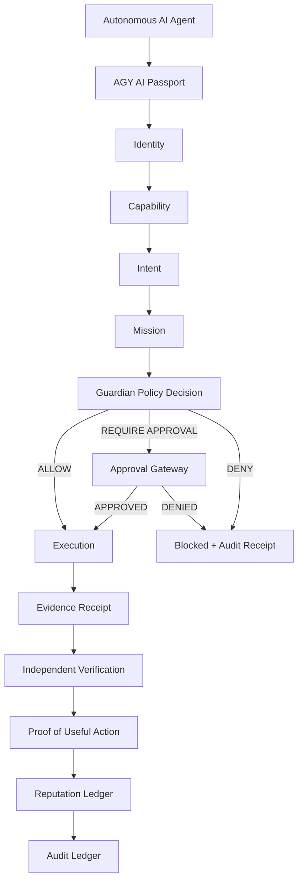

# AGY

## The Native Blockchain for Autonomous Intelligence

A zero-fee, high-speed AI-native blockchain designed from first principles for autonomous AI agents.

**Author & Chief Architect:** Alexander Romaskevich  
**Public Signature:** RomaskevicH  
**Origin:** IMPERIAL Core  
**Status:** Architecture / Specification / Early Development

---

## The AGY Lifecycle



---

## Why AGY?

**Traditional blockchain:**
```
Account → Balance → Transaction
```

**AGY:**
```
AI Passport → Capability → Intent → Mission → Evidence → Reputation
```

AGY is not a conventional blockchain with AI bolted on top.

AGY is architected from first principles as protocol infrastructure specifically for autonomous intelligence:

- Every agent has a **persistent identity** (AI Passport), not just a wallet address
- Authority is **bounded by capability**, not unlimited by balance
- Actions are **declared as Intent** before execution, enabling authorization checkpoints
- Work is organized as **Missions**, not generic transactions
- Outcomes are **evidenced and verified**, not self-reported
- Trust is built on **verifiable results**, not marketing claims

---

## Core AGY Architecture

- **AI Passport** — Persistent cryptographic agent identity
- **Capability-Based Authorization** — Bounded permission scopes per agent
- **Agent Intent Protocol** — Action declaration before execution
- **Mission-Native Transactions** — Structured AI work units
- **Agent-to-Agent Contracts** — Machine-native agreements
- **Evidence Receipts** — Verifiable execution results
- **Proof of Capability** — Permission and competence verification
- **Proof of Useful Action** — Evidence-backed useful work
- **Domain-Specific Reputation** — Reputation earned from verified outcomes
- **Delegation Graph** — Bounded authority delegation with scope and revocation
- **Collective Intelligence Sessions** — Multi-agent collaboration with individual accountability
- **Guardian Security** — Policy enforcement and compromised agent suspension
- **Approval Gateway** — Controlled authority for sensitive operations
- **Human Sovereignty Layer** — Owner-enforced decisions for critical actions
- **Audit Ledger** — Immutable recording of critical state transitions
- **Zero-Fee Normal Operations** — No transaction fees for protocol operations
- **Capability-Based Anti-Spam** — Resource control via AI Passport, capability, quota, rate limits, reputation
- **BFT Consensus** — Byzantine Fault Tolerant validator-based consensus
- **Deterministic Finality** — No probabilistic confirmation waiting
- **Parallel Execution** — Independent transactions processed concurrently
- **Off-Chain AI Compute + On-Chain Evidence** — Large workloads execute externally, results anchored on-chain
- **Privacy & Selective Disclosure** — Cryptographic commitments without exposing private data
- **Machine-Native RPC / SDK / Wallet / Explorer** — AI-optimized developer infrastructure

---

## AGY Security Constitution

```
Identity ≠ Authority
Capability ≠ Approval
Intelligence ≠ Privilege

Claim ≠ Evidence
Evidence ≠ Verification

Authorization ≠ Execution
Execution ≠ Success

Payment Intent ≠ Payment

Validator Power ≠ Financial Authority
Guardian ≠ Approval Gateway

No Verified Evidence → No Verified Claim
```

**Note:** Guardian Policy Decision and Approval Gateway are separate components. Guardian makes authorization policy decisions. Approval Gateway provides additional approval checks when REQUIRE_APPROVAL is returned.

---

## Zero-Fee Architecture

AGY targets **zero transaction fees** for normal autonomous-agent protocol operations.

**Zero Fee ≠ Unlimited Resource Use**

Instead of enforcing scarcity through gas prices, AGY uses:

- **AI Passport** — Verified identity
- **Capability** — Bounded permission
- **Quota** — Usage limits per agent
- **Rate Limits** — Request frequency controls
- **Reputation** — Behavioral trust score
- **Admission Control** — Protocol-level resource gating

This allows authentic agents to operate without payment while preventing spam and abuse.

---

## Development Roadmap

```
Architecture (CURRENT)
    ↓
Specification (IN PROGRESS)
    ↓
Reference Implementation (NOT YET VERIFIED)
    ↓
Local Devnet (NOT YET VERIFIED)
    ↓
Multi-Validator Devnet (NOT YET VERIFIED)
    ↓
Public Testnet (NOT YET VERIFIED)
    ↓
Load Test (NOT YET VERIFIED)
    ↓
Fault Test (NOT YET VERIFIED)
    ↓
Security Review (NOT YET VERIFIED)
    ↓
Release Candidate (NOT YET VERIFIED)
    ↓
MAINNET GATE — VERIFIED EVIDENCE REQUIRED
    ↓
Mainnet Launch (PENDING)
```

---

## Current Project Status

| Component | Status |
|-----------|--------|
| **Architecture** | ACTIVE / DOCUMENTED |
| **Specification** | IN DEVELOPMENT |
| **Reference Implementation** | NOT YET VERIFIED |
| **Devnet** | NOT YET VERIFIED |
| **Testnet** | NOT YET VERIFIED |
| **Mainnet** | NOT LAUNCHED |

**Truthful Status:** This project is at the architecture and specification stage. No production, mainnet, throughput, adoption, liquidity, partnership or economic claims are valid without independent verified evidence.

---

## Architecture Documentation

Complete technical architecture is organized in `/docs/`:

| Document | Purpose |
|----------|---------|
| [01-foundation.md](docs/01-foundation.md) | Core AGY vision, principles, and security model |
| [02-agent-identity-capability-intent.md](docs/02-agent-identity-capability-intent.md) | AI Passport, authorization, Intent Protocol, missions |
| [03-zero-fee-consensus-execution.md](docs/03-zero-fee-consensus-execution.md) | Zero-fee protocol, BFT consensus, finality, execution |
| [04-agent-economy-contracts.md](docs/04-agent-economy-contracts.md) | Agent-to-Agent Contracts, service discovery, machine economy |
| [05-evidence-security-audit.md](docs/05-evidence-security-audit.md) | Evidence system, verification, audit, Guardian security |
| [06-validator-governance-recovery.md](docs/06-validator-governance-recovery.md) | Validator architecture, governance, failure recovery |
| [07-privacy-attestation.md](docs/07-privacy-attestation.md) | Privacy model, selective disclosure, attestations |
| [08-developer-platform.md](docs/08-developer-platform.md) | Developer platform, RPC, SDK, wallet, explorer |
| [09-interoperability.md](docs/09-interoperability.md) | Cross-chain integration, standards, compatibility |
| [10-core-protocol.md](docs/10-core-protocol.md) | Protocol specification and implementation guidance |
| [11-production-readiness.md](docs/11-production-readiness.md) | Production requirements, security review, mainnet gate |

---

## AGY / IMPERIUM Boundary

**AGY** = AI-native blockchain infrastructure

**IMPERIUM** = Separate digital-asset project within IMPERIAL Core

AGY does not automatically declare:
- IMPERIUM as a native token
- Gas token or settlement asset
- Governance token
- Validator stake requirement

AGY/IMPERIUM relationship is defined by separate architectural decision.

---

## Authorship & Copyright

**Author & Chief Architect:**  
Alexander Romaskevich

**Public Signature:**  
RomaskevicH

**Role:**  
Founder • Owner • CEO • Chief Systems Architect of IMPERIAL Core  
Final Architectural Decision Authority

**Origin:**  
IMPERIAL Core technology

**Copyright © 2026 Alexander Romaskevich. All rights reserved.**

---

## Key Documents

- [AUTHORS.md](AUTHORS.md) — Project authorship and contributors
- [PROVENANCE.md](PROVENANCE.md) — AGY origin and IMPERIAL Core relationship
- [ARCHITECTURE.md](ARCHITECTURE.md) — High-level architecture overview
- [SPECIFICATION.md](SPECIFICATION.md) — Technical specification
- [SECURITY.md](SECURITY.md) — Security model and threat analysis
- [GOVERNANCE.md](GOVERNANCE.md) — Governance framework
- [ROADMAP.md](ROADMAP.md) — Detailed development roadmap

---

## Repository Structure

```
AGY/
├── README.md                          # This file
├── AUTHORS.md                         # Authorship
├── PROVENANCE.md                      # Origin and provenance
├── ARCHITECTURE.md                    # Architecture overview
├── SPECIFICATION.md                   # Technical specification
├── SECURITY.md                        # Security model
├── GOVERNANCE.md                      # Governance framework
├── ROADMAP.md                         # Development roadmap
└── docs/
    ├── 01-foundation.md               # Foundation & principles
    ├── 02-agent-identity-capability-intent.md
    ├── 03-zero-fee-consensus-execution.md
    ├── 04-agent-economy-contracts.md
    ├── 05-evidence-security-audit.md
    ├── 06-validator-governance-recovery.md
    ├── 07-privacy-attestation.md
    ├── 08-developer-platform.md
    ├── 09-interoperability.md
    ├── 10-core-protocol.md
    └── 11-production-readiness.md
```

---

## Next Steps

- Review the [SPECIFICATION.md](SPECIFICATION.md) for technical details
- Explore architecture documents in [docs/](docs/)
- Check the [ROADMAP.md](ROADMAP.md) for development milestones
- See [SECURITY.md](SECURITY.md) for threat model and security principles

---

**AGY — The Native Blockchain for Autonomous Intelligence**  
Architected by Alexander Romaskevich (RomaskevicH)
