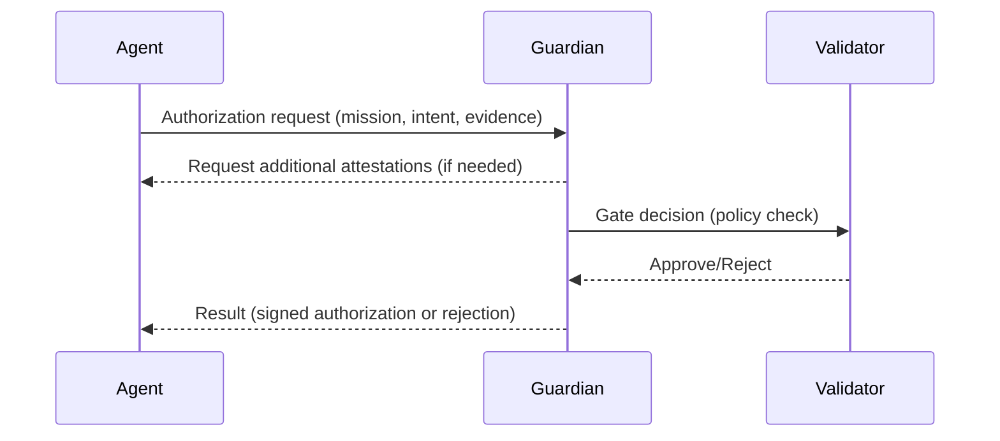

Author & Chief Architect: Alexander Romaskevich (RomaskevicH)

Security Principles (short)
- Identity ≠ Authority
- Capability ≠ Approval
- Intelligence ≠ Privilege
- Claim ≠ Evidence
- Evidence ≠ Verification
- Authorization ≠ Execution
- Execution ≠ Success
- Payment Intent ≠ Payment
- Validator Power ≠ Financial Authority

Design patterns and protections
- Zero Trust: Assume untrusted endpoints; require explicit proof for sensitive operations.
- Guardian: An approval gateway mediating authorization requests for mission-critical actions.
- Approval Gateway: Policy-driven check point for capability escalation and financial operations.
- Agent Behavior Firewall: Ruleset and runtime enforcement layer to detect and prevent unsafe agent behaviors.
- Capability escalation protection: Multi-step approvals and time-locked confirmations for privilege elevation.
- Revocation: Cryptographic and protocol primitives to revoke credentials, capabilities, and delegated authorities.
- Fail-closed behavior: Where safety is critical, components default to deny/closed on failure.
- Key Separation: Distinct keys and key roles for identity, signing, custody, and validator operation.
- Prompt Injection Boundary: Explicit runtime boundaries between agent prompts and authoritative execution contexts.
- Financial Authority Separation: Validator power is distinct from custody or financial authority unless explicitly and separately designed.
- Security Status Truth: Protocol-level statements about security posture must be backed by evidence; do not claim audits unless performed.

Operational guidance
- Avoid definitive "security audited" statements unless a formal audit report exists and is referenced.
- Document revocation and emergency governance flows in GOVENANCE.md.

Mermaid — Guardian approval flow

