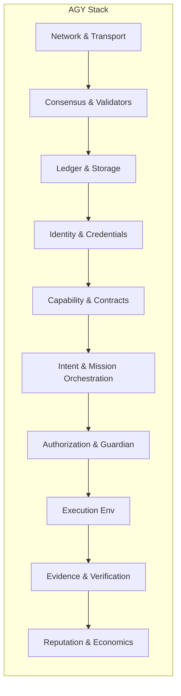

Author & Chief Architect: Alexander Romaskevich (RomaskevicH)

Foundation and core principles for AGY.

Principles
- Human-in-the-loop safety for critical operations.
- Evidence-first verification for claims and payouts.
- Least privilege and capability scoping.
- Deterministic and auditable mission execution where required.

Mermaid — protocol stack

Boundary notes
- AGY is the AI-native infrastructure. IMPERIUM is a separate digital-asset project within IMPERIAL Core. Architectural decisions that link tokens or settlement between these systems must be explicit and separately authorized.
