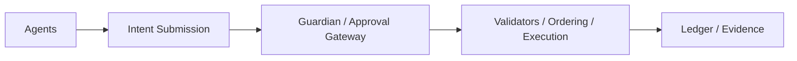

Author & Chief Architect: Alexander Romaskevich (RomaskevicH)

Zero-fee consensus and execution model (architectural draft)

High-level goals
- Enable agent-native interactions with low friction for on-chain expression of intent.
- Preserve economic discipline and anti-spam via policy and governance, not mandatory native gas tokens unless explicitly specified.

Consensus overview
- Validators maintain ledger, order intents, and participate in authorization gating as defined by Guardian policies.

Execution model
- Zero-fee execution refers to a design pattern where transaction fees are not mandatory at protocol level; economic controls are provided via capability policies, rate limits, and off-chain accounting where appropriate.

Mermaid — consensus & execution

Caveat: "Zero-fee" is a policy/architectural approach and does not imply removal of economic controls. Specific tokenization, fee models, and settlement layers must be specified separately.
