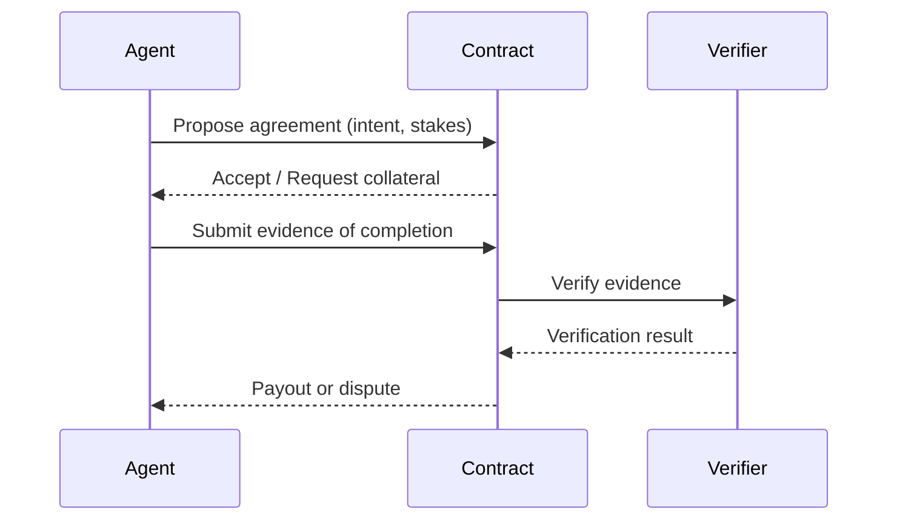

Author & Chief Architect: Alexander Romaskevich (RomaskevicH)

Agent economy and contracts (overview)

Design goals
- Enable agents to enter economic agreements expressed as contracts with clear evidence and verification primitives.
- Keep economic authority and validator power separated unless explicitly defined.

Contracts
- Contract primitives expose capability-based interfaces, intent conditions, and evidence-based payouts.
- Contracts may be on-chain, off-chain, or hybrid. Settlement assets and token models are out of scope until specified.

Mermaid — contract life

