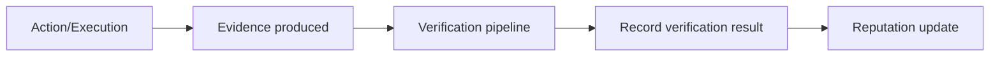

Author & Chief Architect: Alexander Romaskevich (RomaskevicH)

Evidence model and security audit considerations

Evidence
- Evidence = cryptographic and data artifacts produced by execution that can be verified independently.
- Claim != Evidence. Claims require evidence; evidence requires verification.

Verification
- Verification pipelines validate signatures, attestations, execution traces, and tamper-evidence.
- Verification results are recorded to enable reputation updates and dispute handling.

Security audit considerations
- Maintain clear attack surface description.
- Preserve immutable evidence for post-incident analysis.
- Do not claim "audited" without a documented third-party audit report.

Mermaid — evidence verification

