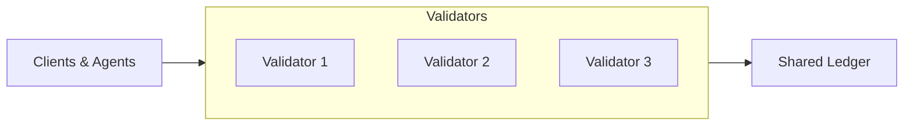

Author & Chief Architect: Alexander Romaskevich (RomaskevicH)

Validator governance, recovery, and topology

Validator topology
- Validators operate as the consensus & ordering layer. Network topology and fault tolerance are defined in the specification.

Onboarding and governance
- Validator onboarding requires proposal, review, and governance voting per GOVENANCE.md and specification.
- Recovery and emergency removal processes documented in governance and security sections.

Mermaid — validator topology (simplified)

