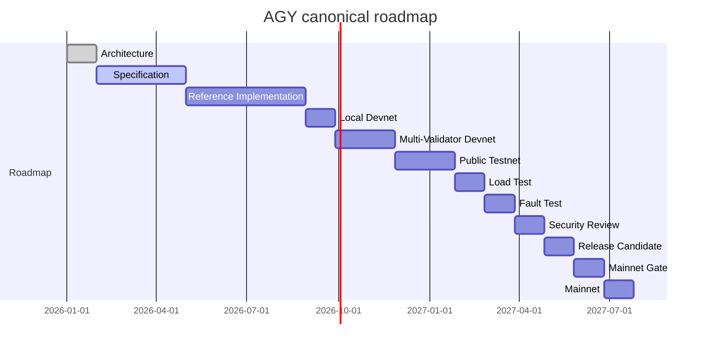

Author & Chief Architect: Alexander Romaskevich (RomaskevicH)

Production readiness checklist

Non-exhaustive gate criteria
- Architecture documented (yes)
- Specification: sufficiently complete to implement core primitives
- Reference implementation: verified against spec
- Multi-validator devnet: operational
- Public testnet: open and monitored
- Load and fault testing: completed with results
- Security review: formal third-party audit and response
- Release candidate: tested, hardened, and signed off
- Mainnet gate: activation plan, timelocks, and community readiness

Operational controls
- Monitoring, observability, and incident response
- Key management and rotation processes
- Backup and recovery plans

Mermaid — roadmap (simplified)

